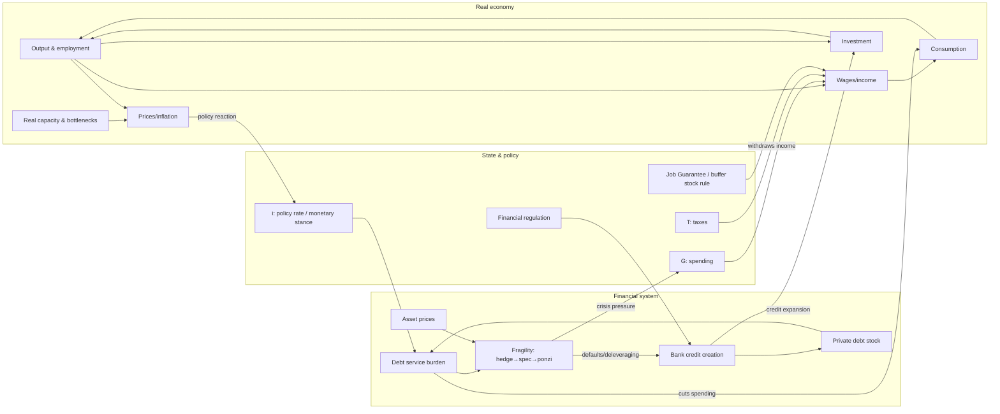
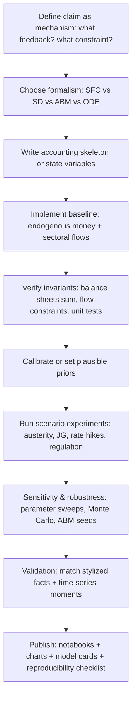

# Integrating Minsky and Simulation into a Functionalist Blog on Money and Policy Mismatch

## Executive summary

This write-up revises your blog thesis by adding a **Minskyan fragility layer** and then translating the combined MMT–Minsky–systems perspective into **testable, reproducible simulation workflows**. The core upgrade is: policy mismatch is not only “confusing a currency issuer with a household,” but also **misreading the system’s stability conditions when private finance endogenously manufactures fragility**. In Minsky’s Financial Instability Hypothesis (FIH), the economy can shift from **stable** to **deviation-amplifying** financing regimes as leverage and “margin of safety” erode, without needing large exogenous shocks. citeturn6view0

You can connect this directly to MMT’s operational and accounting claims. Sectoral balances and flow-of-funds identities are not moral judgments; they constrain what combinations of “thrift,” “surplus,” and private net saving can coexist. citeturn13view1turn5view3 Austerity becomes a canonical mismatch when it treats the public deficit as the target variable while ignoring (a) the private sector’s desired net financial accumulation, and (b) the way reduced income/profits can accelerate financial fragility and debt-deflation dynamics. citeturn13view1turn14view0turn5view7

On the constructivist side, you can make the blog unusually defensible by pairing claims with small “model families” readers can run:  
- **Stock-flow consistent (SFC)** models (discrete-time, accounting-first),  
- **System dynamics** models (feedback-first, stocks/flows visual),  
- **Agent-based models (ABM)** (heterogeneity-first, distribution of fragility states), and  
- **Keen-style nonlinear ODE / hybrid models** (continuous-time leverage cycle dynamics). citeturn16search2turn3search3turn3search0turn5view2turn19view0  

The report below provides: a rigorous conceptual integration; a table comparing modeling approaches; open-source tools; code snippets/pseudocode in Python/NetLogo/Julia/R/system-dynamics tooling; 4 reproducible experiments; mermaid diagrams; and an audit of the defensibility of both the new Minsky claims and the modeling assumptions.

## A rigorous Minsky–MMT–systems integration

### Minsky’s FIH as a systems-theoretic claim about regime change

Minsky’s FIH is explicitly compatible with systems language because it distinguishes **financing regimes**: when “hedge finance” dominates, the economy “may well be an equilibrium seeking and containing system,” but as “speculative and Ponzi finance” grows, the system becomes “deviation amplifying.” citeturn6view1 This is a regime-shift statement: stability properties depend on balance-sheet composition, not only on technology/preferences or external shocks. citeturn6view0

A key contribution you can quote/paraphrase carefully (and then model) is Minsky’s classification of income–debt relations:  
- **Hedge** units can meet contractual payment obligations from cash flows,  
- **Speculative** units can meet interest but must roll over principal,  
- **Ponzi** units can’t meet principal or interest from operations and must borrow or sell assets—reducing their “margin of safety.” citeturn6view0turn6view1  

The “two theorems” (in his 1992 statement) are especially blog-friendly because they are falsifiable in simulation: (1) the economy can be stable under some financing regimes and unstable under others; (2) prolonged prosperity tends to shift financing toward fragility (hedge → speculative/Ponzi). citeturn6view0

### Endogenous money: why fragility can grow “inside” the system

To integrate Minsky with your money-function thesis, you need a crisp operational anchor: modern economies do not run on a fixed pile of “loanable funds.” A widely cited central bank explanation is that **commercial bank lending creates deposits** (“the act of lending creates deposits”), rather than deposits passively funding lending. citeturn5view5 That is endogenous money in plain language and is consistent with Minsky’s emphasis that finance is innovative and destabilizes quantity-theory assumptions about a fixed “money” with stable velocity. citeturn6view0

This matters for policy mismatch because it means: even if the state is “disciplined,” private credit creation can still expand balance sheets, bid up asset prices, and shift financing toward speculative/Ponzi profiles—until a reversal triggers sudden deleveraging. citeturn6view0turn11view3

### Connecting Minsky to MMT: issuer vs user, sectoral balances, and stabilizers

A strong, defensible bridge between Minsky and MMT is to treat government finance not as “funding,” but as **system design for stability**:

- **Sectoral balances/flow-of-funds constraints:** Tymoigne and Wray argue that flow-of-funds accounting uses balance sheets for the major sectors and implies that not all sectors can be net lenders simultaneously; it is “inconsistent” to promote private thriftiness while aiming for a government surplus. citeturn13view1  
- **Issuer vs user as institutional design:** In MMT terms, the currency issuer can always clear payments in its unit of account given the standard sovereignty conditions, but the binding constraints become inflation/real resources and self-imposed institutions. (For operational plumbing, it is useful to note: a dollar paid in taxes reduces bank reserves, while Treasury spending increases reserves—one reason “household analogies” fail mechanically.) citeturn15view0turn13view2  
- **Government deficits as “floor” and safe-asset provision:** In a Minskian framing, fiscal deficits can stabilize profits/income and portfolios. Wray and Tymoigne summarize a core idea: a government-spending-led expansion “would allow the private sector to expand without creating fragile balance sheets,” and deficits add “safe treasury debt” to private portfolios while boosting profits and employment via the spending multiplier. citeturn11view0  
- **Big government / big bank stabilizers:** Wray (channeling Minsky) argues that if the budget is biased toward surplus during growth, it creates “fiscal drag” that removes household income and firm profits—potentially causing recession before fragile financing dominates. He also summarizes the “big bank” lender-of-last-resort role and why interest-rate hikes can hasten transitions toward speculative/Ponzi positions by raising finance costs. citeturn14view0  

This gives you a clean “policy mismatch” template:

> Balanced-budget austerity is not just normatively questionable; it can be systemically destabilizing because it withdraws income/profits that validate private debt structures, while endogenous money and financial innovation continue to amplify fragility inside the private sector.

You can empirically ground the “austerity is contractionary” portion using IMF work: their analysis of fiscal consolidation in advanced economies finds that consolidation typically reduces output and raises unemployment in the short term. citeturn5view7 Their later work with Blanchard & Leigh documents that planned consolidations were associated with larger-than-expected growth shortfalls, consistent with forecasters underestimating fiscal multipliers early in the crisis period. citeturn1search3

### Real-resource constraints and inflation: integrating the “real” boundary with fragility

A rigorous integration also needs a consistent boundary condition: you can’t treat money/finance as unconstrained. Tymoigne and Wray explicitly frame inflation as “a real constraint, not a financial constraint,” in the sense that at full employment, more spending can mainly raise prices. citeturn13view3

Minsky adds an important warning about the *interaction* between inflation control and fragility. In his 1992 statement, he argues that if an economy with many speculative units is inflationary and authorities “attempt to exorcise inflation by monetary constraint,” speculative units can become Ponzi units, forcing asset sales and risking a collapse of asset values. citeturn6view1

So your blog can avoid a common weakness (“MMT ignores inflation”) by stating, more defensibly:

> The binding constraints are real resources and inflation dynamics, but **the choice of inflation-control instrument** (unemployment buffer vs employment buffer; rate hikes vs targeted fiscal/structural measures) changes the system’s fragility trajectory. citeturn6view1turn9search3turn13view3  



## Modeling approaches and when each is the right instrument

A constructivist blog is more defensible if you **use multiple model types as cross-checks**, because each formalism has different failure modes (Goodharting your own assumptions). Keen’s 1995 paper is directly useful as meta-methodology here: he argues the goal is often not exact quantification but capturing cyclical/stability properties, noting that nonlinear dynamics pushes emphasis “from prediction to simulation.” citeturn19view3

### Comparison table of modeling approaches

| Approach | What it’s best for in your blog | Strengths | Weaknesses | Data needs (typical) | Typical time-to-prototype (rule of thumb) |
|---|---|---|---|---|---|
| Stock-flow consistent (SFC) | Sectoral balances, issuer vs user constraints, fiscal rules, accounting-driven policy mismatch | Enforces accounting consistency; clear mapping to flow of funds; good for austerity/fiscal rule experiments | Often representative-sector; limited heterogeneity unless extended; inflation/price formation can be stylized | National accounts, flow-of-funds, balance sheet aggregates | 1–7 days (fast if starting from a template) |
| System dynamics (SD) | Feedback narratives, leverage cycles, policy rules, “diagram-first” explanations | Excellent for communicating feedback loops; easy scenario analysis; natural for Minsky-style causal structure | Can hide accounting inconsistencies unless carefully designed; calibration can be ad hoc | Time series for key stocks/flows; parameter estimates | 1–5 days (diagram-to-sim quick) |
| Agent-based modeling (ABM) | Distribution of fragility (hedge/spec/Ponzi), emergent crises, inequality channels, micro-to-macro narratives | Heterogeneity and network effects; can classify agents into Minsky states; realistic institutional rules | Harder to calibrate/validate; results can be sensitive to micro rules; reproducibility requires discipline | Micro distributions, firm/household heterogeneity, banking rules | 1–4 weeks (faster with a minimal model) |
| Keen-style nonlinear ODE / hybrid models | Leverage-driven cycles, debt-deflation dynamics, stability analysis, clear “mechanism” experiments | Compact, analyzable; fast to sweep parameters; aligns with Keen’s formalizations of Minsky | Aggregation hides distribution; mapping to real institutions may be coarse | Macro series (debt ratio, wages share, employment proxy) | Hours–3 days (very fast to iterate) |
| ABM–SFC hybrids | Minsky fragility distribution + accounting discipline | Combines heterogeneity with consistency; natural for banks + sectors | More engineering; fewer standard templates | Both macro and micro inputs | 2–8 weeks |

### How to connect each approach to Minsky + MMT claims

- **SFC models** operationalize the MMT side: sector balances, safe-asset provision, fiscal drag versus stabilizers, and the feasibility of “private thrift + public surplus.” citeturn13view1turn11view0  
- **System dynamics** operationalizes the feedback story: endogenous credit → debt stock → debt service → spending cuts → output decline → defaults → tighter credit (a canonical Minsky accelerator). Minsky himself frames the economy as having stable vs unstable regimes and emphasizes how policy interventions attempt to keep it within “reasonable bounds.” citeturn6view0  
- **ABM** is where the hedge/speculative/Ponzi taxonomy becomes vivid: you can literally count the share of agents in each state, test how it evolves under different policy rules, and show how macro stability can coexist with micro fragility (until it doesn’t). citeturn6view0turn11view3  
- **Keen-style ODE models** give you minimal mechanism tests: Keen models “four basic insights” of FIH (euphoria-driven debt, long-term debt, inequality effects, stabilizing government) and shows that adding these converts a stable cycle into chaotic breakdown possibility. citeturn19view0 His later “monetary Minsky model” explicitly targets debt deflation, endogenous money, nonlinear dynamics, and ODE structure. citeturn5view2

image_group{"layout":"carousel","aspect_ratio":"16:9","query":["Minsky financial instability hypothesis hedge speculative ponzi diagram","stock flow consistent model godley table example","system dynamics stock and flow diagram debt deflation","agent based model macroeconomics visualization"],"num_per_query":1}

## Open-source tools and implementable simulation strategies

This section lists tools you can confidently recommend because they’re open-source, documented, and aligned with your model families—plus a “minimal viable modeling” strategy for each.

### Agent-based modeling toolchain

For ABM, you want a framework that supports (a) many agents, (b) scheduling, (c) data collection, and ideally (d) visualization.

- **Mesa (Python)** is an agent-based modeling framework emphasizing rapid model creation and analysis/visualization workflows in Python. citeturn3search0turn3search4  
- **NetLogo** is a programmable modeling environment widely used for agent-based simulations; it is open-source and has long-standing documentation/tutorial support. citeturn3search5turn3search1  
- **Agents.jl (Julia)** is a general-purpose ABM framework in Julia, designed for performance and a clear workflow. citeturn3search2turn3search18  

A defensible ABM design for your blog is to define three core agent types (households, firms, banks) plus a government/central-bank policy module, then implement Minsky states at the firm/household level as a classification of cash-flow coverage ratios consistent with the hedge/speculative/Ponzi taxonomy. citeturn6view0

### System dynamics toolchain

- **PySD (Python)** runs system dynamics models in Python by translating Vensim or XMILE models and enabling scenario changes and analysis. citeturn3search3turn3search11  
- **BPTK-Py (Python)** supports building SD and ABM models natively in Python and managing scenarios. citeturn4search2turn4search6  
- **Minsky (the modeling program)** is an open-source SD program designed for economics and includes a “Godley Table” feature using double-entry bookkeeping to generate stock-flow consistent models of financial flows. citeturn18view0  

The “Minsky software + Godley Table” angle is very on-theme for your blog because it visually expresses how money is both a **measurement system** and a **constraint system**—flows must add up, stocks must reconcile. citeturn18view0turn13view1

### Stock-flow consistent modeling toolchain

SFC is where you can make the blog bulletproof against “handwavy” accusations, because the accounting structure forces clarity.

- **sfcr (R)** is designed to “write, simulate, and validate” SFC models, with algorithms such as Gauss–Seidel and Broyden; it explicitly situates itself in the Godley–Lavoie SFC tradition. citeturn16search2turn16search10  
- **godley (R)** supports defining, simulating, validating SFC models; it is explicitly aimed at scenario analysis, sensitivity analysis, and shocks. citeturn16search3turn16search7  
- **SFC_models / sfc_models (Python)** is a Python framework for constructing and solving SFC models. citeturn4search0turn4search16  
- **sfctools (Python)** is an ABM–SFC toolbox that aims to ensure stock-flow consistency while modeling agent heterogeneity and economic balance sheets. citeturn16search0turn16search4  

### Differential equation toolchain for Keen-style models

- **SciPy ODE solver (`solve_ivp`)** is the standard modern approach for solving initial value ODE systems in Python. citeturn12search3turn12search11  
- **DifferentialEquations.jl (Julia/SciML)** is a high-performance suite for solving differential equations with extensive tooling. citeturn12search0turn12search8  
- **ModelingToolkit.jl (Julia/SciML)** supports symbolic model specification and generation of fast functions, useful for parameter sweeps and consistent model definition. citeturn12search1turn12search9  
- **deSolve (R)** provides ODE solver interfaces and a well-documented workflow for defining rate-of-change functions and solving. citeturn12search2turn12search13  

### Timeline flowchart for simulation development



## Code snippets and minimal pseudocode templates

The point of these snippets is not to give a full macro simulator in-line; it’s to give you **copy/paste-able scaffolds** that make your blog “runnable.”

### Python (SciPy) skeleton for a Keen-style leverage-cycle ODE

```python
import numpy as np
from scipy.integrate import solve_ivp

def keen_minsky_ode(t, y, p):
    # y = [employment_rate, wage_share, debt_to_output]
    e, w, d = y
    
    # Example placeholders (you will replace with Keen-style functions):
    # investment depends on profits and debt burden; debt evolves with credit; wages depend on employment
    profit_share = max(1.0 - w, 0.0)
    
    # Risk premium rises with debt ratio (Keen-style extension often includes this mechanism)
    r = p["r0"] + p["phi"] * d
    
    # Simple illustrative dynamics (NOT a validated Keen replication)
    de_dt = p["alpha"] * profit_share - p["beta"] * r * d
    dw_dt = p["gamma"] * (e - p["e_star"]) * w
    dd_dt = p["kappa"] * (p["inv_sens"] * profit_share - r * d)
    
    return [de_dt, dw_dt, dd_dt]

params = dict(r0=0.02, phi=0.02, alpha=0.5, beta=0.1, gamma=0.2, e_star=0.94, kappa=0.4, inv_sens=1.2)

y0 = [0.94, 0.6, 1.0]  # baseline: employment, wage share, debt ratio
sol = solve_ivp(lambda t, y: keen_minsky_ode(t, y, params),
                t_span=(0, 200), y0=y0, max_step=0.1, rtol=1e-6, atol=1e-9)

# Typical outputs you’d chart: sol.t, sol.y[0], sol.y[1], sol.y[2]
```

This uses `solve_ivp`’s “derivative + time span + initial conditions → trajectory” workflow. citeturn12search11turn12search3  
To make it specifically Keen/Minsky, you would implement (a) the nonlinear investment and wage functions and (b) the debt dynamics described in Keen’s Minsky models, including the role of endogenous money and nonlinear instability. citeturn19view0turn5view2

### Python (Mesa) ABM scaffold for banks–firms–households + a Minsky fragility classifier

```python
from mesa import Model
from mesa.time import RandomActivation
from mesa.datacollection import DataCollector

class Economy(Model):
    def __init__(self, n_households=500, n_firms=50, n_banks=5, policy=None):
        super().__init__()
        self.schedule = RandomActivation(self)
        self.policy = policy or {}
        self.t = 0

        # TODO: create agents (Household, Firm, Bank). Each Firm has:
        # cash_flow, interest_due, principal_due, assets, liabilities

        self.datacollector = DataCollector(
            model_reporters={
                "unemployment": lambda m: m.compute_unemployment(),
                "private_debt_to_income": lambda m: m.compute_debt_ratio(),
                "ponzi_share": lambda m: m.compute_ponzi_share(),  # Minskian fragility distribution
            }
        )

    def classify_minsky_state(self, unit):
        """
        Hedge: cash_flow >= interest + principal
        Speculative: cash_flow >= interest but < interest + principal
        Ponzi: cash_flow < interest
        """
        cf = unit.cash_flow
        i = unit.interest_due
        p = unit.principal_due
        if cf >= i + p:
            return "hedge"
        elif cf >= i:
            return "speculative"
        else:
            return "ponzi"

    def step(self):
        self.t += 1
        # Apply policy (taxes/spending/job guarantee/interest-rate rule)
        # Then step agents; banks create deposits when they lend (endogenous money)
        self.schedule.step()
        self.datacollector.collect(self)
```

The ABM logic directly implements Minsky’s hedge/speculative/Ponzi taxonomy as a measurable state variable. citeturn6view0 Mesa is explicitly built for ABM creation + analysis workflows in Python. citeturn3search0turn3search4

### NetLogo pseudocode for endogenous credit + job guarantee as a buffer stock

```NetLogo
; turtles: households and firms
; breeds: [households household] [firms firm] [banks bank]

to go
  ; 1) government sets policy each tick
  ; - job-guarantee wage wJG
  ; - tax rate tau
  ; - spending rule: procyclical austerity vs countercyclical stabilizer

  ; 2) firms set desired production, hire/fire
  ask firms [
    set expected-sales f(expected-sales, last-sales)
    set desired-employment g(expected-sales, productivity)
    hire-or-fire
  ]

  ; 3) households earn income (wages or JG wage), consume, save
  ask households [
    set income (wage-or-jg)
    set consumption h(income, wealth)
  ]

  ; 4) banks accommodate credit demand subject to risk rule
  ask banks [
    ; endogenous money: lending creates deposits
    ; risk premium increases with borrower leverage
    supply-loans
  ]

  ; 5) update balance sheets, debt service, defaults, and Minskian states
  update-financial-positions
  tick
end
```

This is the minimal “policy mismatch laboratory”: you can flip between “balanced-budget rule” and “stabilizer rule,” and watch the distribution of fragility states evolve. The fact that bank lending creates deposits is the operational anchor for endogenous money. citeturn5view5

### R (sfcr) micro-template for an SFC model + an austerity scenario

```r
library(sfcr)

# 1) Define a baseline SFC model (high-level sketch)
eqs <- sfcr_set(
  Y ~ C + I + G,
  T ~ tau * Y,
  YD ~ Y - T,
  C ~ c1 * YD + c2 * H,
  H ~ H[-1] + (YD - C),
  DEF ~ G - T
)

# 2) Baseline run
baseline <- sfcr_baseline(
  equations = eqs,
  initial = sfcr_set(H = 100),
  periods = 200,
  external = sfcr_set(G = 20, I = 15, tau = 0.2, c1 = 0.8, c2 = 0.02)
)

# 3) Austerity shock: cut G from period 50 onward
shock <- sfcr_shock(
  baseline,
  variables = sfcr_set(G = 16),  # example: -20%
  start = 50
)

scenario <- sfcr_scenario(baseline, shock)
```

`sfcr` is explicitly designed to write/simulate/validate SFC models and documents its solver approach. citeturn16search2turn16search10

### R (godley) strategy for SFC with built-in validation and shocks

```r
library(godley)

# Pseudocode-style: define variables + equations, then simulate scenarios.
# The package is designed for defining, simulating, validating SFC models
# and supports sensitivity analysis and policy shocks.

# model <- godley_model() %>%
#   add_variable(...) %>%
#   add_equation(...) %>%
#   add_shock(...)
# sim <- simulate(model, periods = 200)
```

The `godley` package description emphasizes scenario analysis, parameter sensitivity, and policy shocks in an SFC setting. citeturn16search3turn16search7

### Julia: Agents.jl + DifferentialEquations.jl “two-layer” strategy

```julia
using Agents
using DifferentialEquations

# Idea: ABM handles heterogeneity + discrete decisions;
# an ODE block can handle fast continuous dynamics (e.g., bank balance sheet adjustment).

# 1) ABM layer (sketch)
@agent struct Firm(ContinuousAgent{2})
    debt::Float64
    cashflow::Float64
end

# 2) ODE layer (sketch)
function bank_balance_sheet!(du, u, p, t)
    # u could represent aggregate reserves, bank capital, etc.
    # implement adjustment speeds, risk premia
end

prob = ODEProblem(bank_balance_sheet!, [1.0, 1.0], (0.0, 100.0))
sol = solve(prob)
```

Agents.jl is a documented ABM framework in Julia. citeturn3search2 DifferentialEquations.jl is a documented suite for numerically solving differential equations in Julia (and interoperable ecosystems). citeturn12search0turn12search8

## Reproducible experiments to test austerity, job guarantees, inflation, and banking

Each experiment below is phrased as a **hypothesis test** about policy mismatch. The goal is not to “prove MMT” or “prove Minsky,” but to demonstrate how model structure changes outcomes—even when you hold goals constant.

### Experiment on austerity as a fragility amplifier under endogenous money

**Question:** Does procyclical deficit reduction (austerity) reduce macro volatility, or does it increase crisis likelihood by reducing the income/profit flows that validate private debt structures?

**Model recommendation:**  
Start with an SFC baseline (sfcr or godley). Add a private debt service channel and a simple fragility indicator like debt-service-to-profits. Extend to ABM–SFC (sfctools) if you want explicit hedge/spec/Ponzi shares.

**Key mechanism grounding:**  
- Fiscal surplus bias can create “fiscal drag,” removing income/profits and causing recession. citeturn14view0  
- Government deficits can stabilize private balance sheets by adding safe assets and supporting profits/employment. citeturn11view0turn13view1  
- IMF evidence: consolidation typically reduces output and raises unemployment short-run. citeturn5view7  

**Parameters to sweep (illustrative):**  
- Shock size: ΔG ∈ {−1%, −2%, −4% of baseline Y}  
- Private credit elasticity (investment response to credit): κ ∈ [0.0, 1.0]  
- Debt service sensitivity: r ∈ [1%, 8%]  
- “Automatic stabilizer strength”: transfers response to unemployment.

**Outputs:** time series of Y, unemployment proxy, DEF, private debt ratio, debt service ratio, fragility indicator; plus impulse responses (multipliers).

**Expected qualitative pattern:** contraction reduces Y and employment; private sector balance sheet stress rises if incomes fall while debt service persists; the model should show conditions where austerity increases fragility measures and crisis probability. This fits the IMF short-run contraction finding and Minskian validation logic. citeturn5view7turn6view1

**Validation metrics:**  
- Short-run fiscal multiplier range compared to IMF estimates/forecast-error evidence. citeturn5view7turn1search3  
- Stylized-fact check: recession episodes coincide with higher defaults/credit tightening in the model (qualitative, then calibrated).  
- Accounting invariants: balance sheets reconcile each period (SFC validation).

**Example output format (illustrative):**
```text
t=50 austerity shock applied: G ↓ 20%
peak ΔY = -2.7% (t=54)
peak unemployment proxy ↑ 1.9 pp (t=55)
private debt / income ↑ from 1.25 to 1.43
debt service / profits ↑ from 0.18 to 0.31
```

### Experiment on job guarantee versus NAIRU-style stabilization

**Question:** If unemployment is used as the “buffer stock” for price stability, does that produce unnecessary unused capacity compared with an employment buffer stock (job guarantee)?

**Model recommendation:**  
ABM (Mesa / NetLogo / Agents.jl) if you want distributional outcomes and explicit labor matching; SFC if you want a clean macro closure; ABM–SFC if you want both and can invest time (sfctools). citeturn3search0turn3search5turn3search2turn16search4

**Key mechanism grounding:**  
Mitchell and Wray describe a Job Guarantee (JG) as “hiring off the bottom,” operating as a buffer stock program that expands in recession and shrinks in expansion. citeturn9search3 Tymoigne and Wray emphasize inflation as a real constraint (not a financial one), which helps frame JG as a structural stabilizer rather than a “free lunch.” citeturn13view3

**Parameters to sweep (illustrative):**  
- JG wage as a nominal anchor: wJG relative to median wage ∈ {0.4, 0.5, 0.6}  
- Wage-setting sensitivity to labor tightness (Phillips-like slope)  
- Capacity/bottleneck severity: markup response αP ∈ [0.0, 0.5]  
- Tax/transfer rule (automatic stabilizer strength)

**Outputs:** unemployment rate, JG employment share, wage inflation, price inflation, output volatility, inequality measures (Gini).

**Expected qualitative pattern:** JG reduces involuntary unemployment volatility; inflation effects depend on bottlenecks and wage-setting rules; importantly, inflation-control “adjustment costs” shift from unemployment toward other channels (composition of demand, taxes, regulation). This matches the MMT claim that inflation policy need not rely on maintaining unemployment, and should be tested rather than asserted. citeturn13view3turn9search3

**Validation metrics:**  
- Inflation volatility vs unemployment volatility tradeoff across regimes.  
- “Real constraint” check: inflation rises when bottlenecks bind even if unemployment is low. citeturn13view3  
- Policy feasibility: sectoral balances remain consistent with desired net saving behavior. citeturn13view1  

### Experiment on monetary tightening as a fragility trigger

**Question:** Under what balance-sheet conditions does raising rates to fight inflation convert speculative finance into Ponzi finance and trigger asset-price collapse dynamics?

**Model recommendation:**  
Keen-style ODE model (SciPy/DifferentialEquations.jl) for rapid parameter sweeps, plus a SD model (PySD/Minsky) for communication.

**Key mechanism grounding:**  
Minsky explicitly states that monetary constraint in an inflationary state can push speculative units into Ponzi positions and force asset sales, risking collapse of asset values. citeturn6view1 Wray summarizes Minsky’s skepticism that rate hikes are a strong stabilizer because higher rates raise finance costs and hasten the shift toward speculative/Ponzi positions. citeturn14view0 Keen’s monetary Minsky model is explicitly built around debt deflation, endogenous money, nonlinear dynamics, and ODE structure. citeturn5view2

**Parameters to sweep (illustrative):**  
- Policy-rate path: step increase Δi ∈ {+100, +300, +500 bps}  
- Risk premium sensitivity to leverage: φ ∈ [0.0, 0.1]  
- Initial debt ratio: d0 ∈ [0.5, 2.5]  
- Asset-price sensitivity to credit growth

**Outputs:** debt ratio trajectories, crisis indicator (e.g., when debt service exceeds cash flow for a threshold share), asset price and credit contraction, output/employment proxy.

**Expected qualitative pattern:** for high enough initial leverage and premium sensitivity, tightening can produce a “Minsky moment” style nonlinear transition (stable cycle → collapse). This is directly aligned with the fragile-regime claim. citeturn6view1turn6view0

**Validation metrics:**  
- Event timing: does the model reproduce the stylized sequencing “credit boom → rising fragility → tightening/shock → deleveraging”?  
- Comparative statics: do crises become more likely as initial leverage rises?

### Experiment on financial regulation as mismatch correction

**Question:** Can targeted financial regulation reduce fragility more efficiently than balanced-budget rules aimed at “sound finance”?

**Model recommendation:**  
ABM (banks as agents with risk rules) or ABM–SFC (sfctools) if you want balance sheets + distribution; SD if you want a clean feedback narrative.

**Key mechanism grounding:**  
Wray and Tymoigne describe how changes in banking models (e.g., originate-and-distribute) can accelerate fragility development by weakening incentives, enabling Ponzi financing early in expansions. citeturn11view3turn11view2

**Parameters to sweep (illustrative):**  
- Capital requirement / leverage cap  
- Loan-to-income rules  
- Countercyclical buffers tied to credit growth  
- Lender-of-last-resort aggressiveness (liquidity provision rule)

**Outputs:** crisis frequency over many runs, distribution of leverage, credit allocation (productive vs asset), output volatility.

**Expected qualitative pattern:** stronger macroprudential constraints reduce extreme leverage tails and crisis frequency, but may also reduce peak booms; you can evaluate this as a stability–growth frontier rather than ideology.

**Validation metrics:**  
- Accounting checks (sum of balance sheets)  
- Crisis identification consistency (clear rule)  
- Sensitivity/robustness across random seeds (ABM discipline)

## Coherence and defensibility audit of the Minsky integration and simulation assumptions

### Defensible Minsky claims to include (and how to phrase them)

1) **FIH is about endogenous regime shifts, not just shocks.**  
Minsky explicitly frames FIH as not relying on exogenous shocks and emphasizes internal dynamics plus the intervention/regulation system intended to keep the economy within bounds. citeturn6view0  
**Defensible phrasing:** “Shocks matter, but fragility can accumulate endogenously; policy acts within a moving stability landscape.”

2) **Hedge/speculative/Ponzi is a cash-flow coverage taxonomy.**  
Minsky’s definitions are clear and operationalizable (cash flows vs contractual commitments). citeturn6view0  
**Defensible phrasing:** “We use Minsky’s categories as an accounting classification; they are not moral labels.”

3) **Inflation control via monetary tightening can interact with fragility.**  
Minsky’s 1992 statement and Wray’s summary make this interaction explicit. citeturn6view1turn14view0  
**Defensible phrasing:** “Rate hikes can be stabilizing in some models but destabilizing in leveraged regimes; therefore instrument choice should be conditional on fragility indicators.”

### Where you must be careful (common overclaims)

- **Overclaim:** “Governments can always spend without constraint.”  
**Fix:** Keep the constraint boundary: inflation/real resources and institutional limits; Tymoigne & Wray explicitly frame inflation as real constraint. citeturn13view3

- **Overclaim:** “Deficits always stabilize.”  
**Fix:** Use a conditional statement consistent with Wray & Tymoigne: deficits can add safe assets and support profits/employment, but the effect depends on composition, distribution, and whether the economy is near real constraints. citeturn11view0turn13view3

- **Overclaim:** “Endogenous money means banks lend without limit.”  
**Fix:** The Bank of England explanation notes that money creation depends on banking system constraints and the monetary policy environment; banks are creators of deposit money, but not unconstrained. citeturn5view5

### Simulation assumptions that can make or break credibility

1) **Prices and inflation model:**  
If you don’t model bottlenecks/markup/wage-setting, inflation outcomes will look arbitrary. Tie inflation to real constraints as per the “real constraint” framing. citeturn13view3

2) **Bank behavior rule:**  
If banks are “always accommodating,” you’ll generate runaway leverage. Use risk premium/capital constraints (Keen uses risk premium linked to debt ratio mechanisms) and/or a supervisory rule. citeturn19view1turn5view2

3) **Government/central bank consolidation assumption:**  
If you model the government as a currency issuer, keep operational plausibility. The Federal Reserve note plainly states tax payments drain reserves and spending adds reserves in the current regime, which you can represent as a balance-sheet operation rather than “printing money.” citeturn15view0

4) **Validation discipline:**  
Keen’s methodological point is useful: treat many experiments as simulation/robustness studies rather than point forecasts. citeturn19view3 Add: unit tests on accounting identities (SFC), seed sweeps (ABM), and parameter sweeps (ODE).

## Revised blog structure and visual program

Below is a blog structure that matches your intention (teach readers to identify policy mismatches) while remaining rigorous and test-driven. The blog outline itself uses a single H1 and 6 H2s (within your requested range).

```markdown
# Money as Measurement, Fragility as State: A Systems Guide to Policy Mismatch

## Executive summary
- What “policy mismatch” means operationally
- Why Minsky + endogenous money changes the story

## What money does in the system
- Money as unit of account / settlement / memory
- Endogenous money: bank lending creates deposits (why this matters)

## The two constraints: real resources and financial fragility
- Real-resource boundary and inflation
- Fragility boundary: hedge → speculative → Ponzi (Minsky taxonomy)

## Issuer vs user and sectoral balances: why the household metaphor fails
- Flow-of-funds logic and sectoral constraints
- Big government/big bank stabilizers vs fiscal drag

## Austerity, unemployment, and the design of stabilizers
- Austerity as a mismatch under slack
- Unemployment buffer stock vs job guarantee buffer stock
- Instrument choice: rates vs targeted fiscal/regulation

## A simulation laboratory readers can run
- Model families: SFC, SD, ABM, ODE
- Reproducible experiments + charts + notebooks
- How to validate (and how not to overclaim)
```

### Opportunities for visuals (high-value, blog-native)

- **One-page “system map”** (like the mermaid diagram above) showing real ↔ financial feedback loops and where policy enters. Anchor the narrative in the idea that money is a measurement/coordination signal, while fragility is an evolving state variable. citeturn6view1turn13view3  
- **Three-panel chart** for each experiment: (1) output/employment, (2) debt ratio + debt service, (3) inflation/bottlenecks proxy.  
- **Fragility distribution plot (ABM):** share of firms/households in hedge/spec/Ponzi states over time. This is the simplest “Minsky in one picture” that readers can understand and you can defend with Minsky’s definitions. citeturn6view0  
- **Reproducibility sidebar:** “Model card” listing assumptions, invariants, parameters, and validation metrics. This is where you operationalize the shift from ideology to implementable inquiry, consistent with Keen’s simulation emphasis. citeturn19view3  

### Suggested embedding strategy for code and outputs

- Publish each experiment as a **notebook-backed post** (Jupyter for Python; Quarto for R/Python; Pluto for Julia) and embed:
  - the *parameter block*,
  - the *run cell*,
  - the *output charts*, and
  - a short “what would falsify this model?” paragraph.

This aligns with the blog’s core educative mission: teaching readers to spot mismatch by connecting narratives to system behavior and constraints that can be inspected, stress-tested, and revised. citeturn6view0turn13view1turn5view5