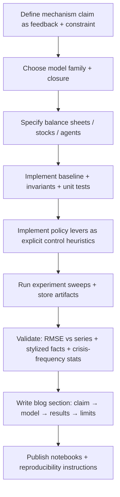

# Integrating Minsky and Reproducible Simulation into a Systems Blog on Money and Policy Mismatch

## Executive summary

Your current draft correctly frames the “household budget” metaphor as a **constraint-architecture error** and treats recurring austerity/rate‑hike failures as the *predictable output* of an incorrect model of the system. fileciteturn1file0 To make the blog more rigorous and defensible, the strongest upgrade is to incorporate **Minsky’s Financial Instability Hypothesis (FIH)** as a *state-dependent fragility layer* that turns ordinary policy errors into **deviation‑amplifying cascades**. citeturn0search0turn0search20

The integrated thesis that is most defensible in the literature is:

- **Money is a coordination and accounting protocol** (unit of account/means of payment) whose operational form in modern economies is largely **bank deposit money** created through bank lending (endogenous money). citeturn0search2turn6search0turn6search5  
- **Currency issuers vs currency users** face different constraint architectures: a sovereign issuer is not operationally constrained by *obtaining* its own unit of account, but is constrained by **inflation**, **real resources**, **external stability**, and **self‑imposed legal/institutional rules**. citeturn1search3turn7search2turn7search0  
- **FIH explains why stability can breed instability**: extended tranquil periods tend to shift balance sheets from “hedge” toward “speculative” and “Ponzi” finance, raising crisis likelihood without requiring large exogenous shocks. citeturn0search0turn0search20  
- Austerity and certain monetary-tightening strategies become **policy mismatches** not only because they misunderstand issuer constraints, but because they can **reduce the cash flows that validate private debt structures**, accelerating transitions toward fragility and crisis. citeturn0search3turn2search3turn0search0  
- To avoid “argument-by-assertion,” the blog can be anchored in **reproducible simulation** across four complementary model families: Stock‑Flow Consistent (SFC), System Dynamics (SD), Agent‑Based Modeling (ABM), and Keen‑style nonlinear differential / hybrid models. citeturn3search0turn5search2turn1search0turn1search1

The remainder of this report provides (a) a revised, rigorous write-up you can adapt into the blog, (b) implementable design specs and minimal code templates in Python/NetLogo/R/Julia, (c) four reproducible experiments with parameters and validation metrics, (d) an audit of coherence and peer‑reviewed support (including criticisms), and (e) an implementable blog outline + coding-agent checklist. citeturn12search9turn12search8turn12search0

## Revised integrated write-up

### Money, constraint architectures, and why “balanced budgets” mis-target the control variable

A systems-theoretic blog can treat “money talk” as a dispute over **what the system is** (architecture), **what state variables matter** (observability), and **what levers plausibly regulate the state** (controllability). Your draft already makes this “wrong model → wrong control actions” point; the simulation program below makes it testable. fileciteturn1file0

Empirically and operationally, modern monetary systems are dominated by **bank deposit money** created through credit extension: when banks make loans, they create deposits (endogenous money), and the central bank’s policy/implementation framework constrains this process indirectly rather than via a simple “money multiplier.” citeturn0search2turn6search0turn6search5 This matters because a governance regime that focuses almost exclusively on the public deficit is implicitly monitoring only one valve in a multi‑valve flow system, while private leverage can silently build destabilizing feedbacks. citeturn0search2turn0search0turn1search1

Within MMT-style operational analysis, the **issuer vs user** distinction is a constraint-architecture distinction: monetarily sovereign issuers have flexibility in meeting obligations denominated in their own unit of account, but they still face binding constraints through inflation and real capacity, external constraints, and legal/institutional constraints (e.g., debt ceilings). citeturn1search3turn7search2turn7search0 Put in systems terms: the deficit is not the system’s conserved quantity; **real resources and price stability** are the boundary conditions, while the fiscal balance is often an *accounting outcome* that co-moves with private saving behavior and foreign balances. citeturn1search3turn8search14

The core “policy mismatch” claim then becomes: **balanced-budget austerity is often the wrong control heuristic**, because it targets an accounting measure rather than the system’s stabilizing variables (employment, price stability, fragile leverage). citeturn0search1turn1search3turn0search3 The IMF’s historical and model-based work on consolidations reports that fiscal consolidation typically reduces output and raises unemployment in the short run, consistent with the idea that deficit-reduction rules can be destabilizing under slack. citeturn0search3turn2search3turn0search7

### Minsky’s FIH as a fragility state variable that amplifies policy mismatch

Minsky’s FIH provides the missing state variable to make “policy mismatch” more than a fiscal-institutional argument: it says the system has financing regimes under which it is stabilizing and regimes under which it is deviation‑amplifying, and that prolonged stability tends to shift the system toward fragility. citeturn0search0turn0search20

Crucially, Minsky defines fragility in **cash-flow coverage terms** (operationalizable in simulation): units can be “hedge” (cash flows cover principal + interest), “speculative” (cash flows cover interest but require refinancing principal), or “Ponzi” (cash flows don’t cover interest; survival requires rising asset prices or new borrowing). citeturn0search0turn0search20 In a system-theoretic mapping, the share of units in speculative/Ponzi positions is a **fragility stock**; the transition rates into those categories are shaped by credit standards, profit/income flows, and interest-rate conditions; and crisis events are often threshold phenomena where feedback changes sign (stabilizing → destabilizing). citeturn0search0turn1search0turn1search1

This directly connects to your policy themes:

- Austerity during downturns reduces incomes/profits, which can lower cash-flow coverage and push agents from hedge → speculative/Ponzi, increasing defaults and contraction. citeturn0search3turn0search0turn12search3  
- Monetary tightening raises debt-service burdens, and in a leveraged regime can accelerate transitions into Ponzi positions, forcing asset sales and debt-deflation dynamics—exactly the state-dependent failure mode Minsky emphasized. citeturn0search0turn1search1turn1search0  
- Sectoral-balance reasoning implies that a sustained government-surplus agenda tends to map to private deficit accumulation (or requires external surpluses), which is a fragility channel if private deficits are debt-financed. citeturn1search3turn8search14  

To make “money is a signal/measure” rigorous, you can frame accounting variables as **observations** of state, while fragility is an evolving latent state that can render common heuristics (balanced budgets, rate hikes) dynamically unsafe in certain regimes. citeturn0search0turn1search1

```mermaid
flowchart LR
  subgraph Real[Real economy]
    Y[Output / income]
    N[Employment]
    W[Wages]
    P[Prices / inflation]
    K[Productive capacity]
  end

  subgraph Finance[Financial system]
    L[Bank loans (credit)]
    D[Deposits (bank money)]
    DS[Debt service]
    F[Fragility state: hedge/spec/Ponzi share]
    DEF[Defaults / write-downs]
    RP[Risk premium / credit rationing]
  end

  subgraph Policy[Policy levers]
    G[Fiscal spending]
    T[Taxes]
    i[Policy rate]
    JG[Job Guarantee wage + buffer rule]
    PRU[Macroprudential constraints]
  end

  %% Real feedbacks
  Y --> N --> W --> Y
  K --> P
  Y --> P

  %% Finance-real feedbacks
  L --> D
  L --> DS --> Y
  DS --> F --> DEF --> RP --> L
  RP --> L
  L --> Y

  %% Policy links
  G --> Y
  T --> Y
  i --> DS
  PRU --> RP
  JG --> N
  P --> i
  F --> G
```

image_group{"layout":"carousel","aspect_ratio":"16:9","query":["Hyman Minsky portrait","Financial Instability Hypothesis diagram","stock-flow consistent model Godley table diagram","agent-based macroeconomic model illustration"],"num_per_query":1}

## Model families as complementary instruments

### Why multiple model families are defensible

A single formalism will bias what you can “see.” A defensible simulation program uses **triangulation**: SFC for accounting correctness, SD for feedback structure, ABM for heterogeneity/distributions of fragility, and Keen-style nonlinear ODE/hybrids for fast stability analysis and regime mapping. citeturn1search0turn1search1turn3search0turn5search2 This reflects the methodology in Keen’s modeling of Minsky (nonlinear dynamics implies emphasis on simulation and regime behavior), while remaining compatible with Godley–Lavoie’s SFC insistence on stock/flow consistency. citeturn1search0turn2search2turn3search4

### Comparison table of modeling approaches

The “typical time-to-prototype” column is a practical heuristic for a coding agent using the toolchains listed later, assuming a minimal model plus one experiment; it is not a theoretical claim. citeturn3search0turn4search0turn5search2turn4search3

| Model family | Best use in your blog | Strengths | Weaknesses | Data needs | Typical time-to-prototype |
|---|---|---|---|---|---|
| SFC (discrete time) | Sectoral balances, issuer vs user, austerity rules, accounting “invariants” | Enforces balance-sheet and flow consistency; transparent fiscal/financial identities | Can hide heterogeneity; price/wage dynamics often stylized | National accounts, flow-of-funds aggregates, debt stocks | 1–7 days citeturn3search0turn3search1 |
| SD (stocks/flows) | Communicating feedback loops; showing “policy lever → state → unintended consequence” | Diagram-first clarity; fast scenario analysis; easy coupling to data pipelines | Accounting consistency can be accidentally violated; calibration can be ad hoc | Time series for a few macro stocks/flows | 1–5 days citeturn5search2turn3search15 |
| ABM | Distribution of fragility states; network contagion; emergent crises | Heterogeneity and thresholds; direct hedge/spec/Ponzi classification | Calibration/validation harder; sensitive to micro-rules | Micro distributions, bank and firm rules, some macro targets | 1–4 weeks citeturn4search0turn4search2turn4search1 |
| Keen-style nonlinear ODE | Leverage cycles; regime maps; fast sweeps; “Minsky moment” thresholds | Compact; analyzable; efficient parameter sweeps | Aggregation hides distribution; institutional fidelity limited | Macro series for calibration (debt ratio, wages share, employment) | hours–3 days citeturn1search1turn4search3 |
| Hybrid ABM–SFC | “Best of both”: distributions + accounting discipline | Heterogeneity with balance-sheet integrity; direct bank defaults | Higher engineering cost; fewer templates | Macro + micro inputs | 2–8 weeks citeturn3search10turn3search1 |

## Implementable design specs and minimal templates

This section is written as **design specs** for a coding agent. Each model family includes: minimal state, invariants, update loop, and how policy levers map to components. Claims about tool capabilities are grounded in official documentation. citeturn4search0turn5search2turn3search0turn5search0

### SFC design spec

**Purpose:** enforce accounting consistency while testing fiscal rules, issuer/user regimes, sectoral balances, and a Minskian “financial fragility” indicator. citeturn2search2turn3search4turn1search3

**Minimal sectors:** Households (H), Firms (F), Banks (B), Government (G), Foreign (X). Optionally split central bank (CB) for issuer/user contrasts. citeturn2search2turn7search0turn1search3

**Minimal balance-sheet objects (stocks):**
- Deposits \(D_H, D_F\), Loans \(L_F\), Government bills \(B_H, B_B\), Bank equity \(E_B\). citeturn0search2turn6search0turn3search15  

**Core accounting identities (must hold every period):**
- Goods-market: \(Y = C + I + G + NX\).  
- Sectoral balances: \(FB_{priv} + FB_{gov} + FB_{for} \equiv 0\) (define each as net lending). citeturn8search14turn1search3  
- Bank money creation consistency: \(\Delta L_F = \Delta D_F\) at loan origination (before repayments/write-downs). citeturn0search2turn6search0  

**Behavioral minimal closures:**
- Consumption: \(C_t = c_1 YD_t + c_2 NW_{H,t-1}\).  
- Investment: \(I_t = \kappa(\pi_t, d_t)\cdot K_{t-1}\) or \(I_t\) as a profit/debt function aligned with Keen-style investment behavior. citeturn1search0turn1search1  
- Taxes: \(T_t = \tau Y_t\).  
- Government rule (scenario-dependent): austerity vs functional finance (defined in Experiments). citeturn0search1turn0search3  

**Minsky fragility indicator (minimal, SFC‑compatible):**
- Define aggregate cash-flow coverage for firms:  
  \(\text{ICR}_t = \frac{\text{Operating cash flow}}{\text{Interest due}}\).  
- Define “speculative/Ponzi share proxy” as \(F_t = \Pr(\text{ICR}_{i,t}<1)\) if you later add heterogeneous firms, or as a continuous fragility index \(F_t = \max(0, 1 - \text{ICR}_t)\) in an aggregate model. This operationalizes Minsky’s hedge/speculative/Ponzi logic without requiring ABM. citeturn0search0turn1search0  

**Issuer vs user regime switch (institutional constraint architecture):**
- Issuer: pin risk-free rate on bills \(i_B\) as policy variable; CB purchases residual supply; no endogenous sovereign spread. citeturn1search3turn7search0  
- User: impose financing condition \(i_B = i_{policy} + \text{spread}(B/Y)\) and optional “market access” constraint that triggers procyclical cuts in \(G\). This mirrors why currency users can face solvency/liquidity problems. citeturn8search19turn12search9  

**Open-source implementation tools:**
- R: `sfcr` and `godley` are explicitly built to define/simulate/validate SFC systems. citeturn3search0turn3search1  
- GUI/SD+SFC: Minsky software uses “Godley Tables” (double-entry bookkeeping) to generate SFC flow structure. citeturn3search15turn3search3  

#### Minimal R template using `sfcr`

```r
library(sfcr)

# Minimal SFC core with government + banks + private debt proxy
eqs <- sfcr_set(
  # Income and demand
  Y ~ C + I + G,
  T ~ tau * Y,
  YD ~ Y - T + rD * Dh[-1],         # disposable income incl deposit interest
  C ~ c1 * YD + c2 * Nh[-1],

  # Households: wealth accumulation
  Nh ~ Nh[-1] + (YD - C),           # net worth
  Dh ~ Dh[-1] + (YD - C),           # deposits as residual wealth container

  # Firms: profits, investment, borrowing
  Pi ~ Y - W - rL * Lf[-1],         # simplified profits
  I ~ kappa0 + kappa1 * Pi - kappa2 * (Lf[-1]/Y),  # Keen-style debt drag
  Lf ~ Lf[-1] + (I - Pi),           # borrowing if investment > profits

  # Government balance
  DEF ~ G - T,
  Bg ~ Bg[-1] + DEF                 # government bills/debt stock

  # (Optional) add inflation/real capacity constraint as a separate block
)

baseline <- sfcr_baseline(
  equations = eqs,
  external = sfcr_set(G = 20, W = 60, rD = 0.01, rL = 0.04, tau = 0.2,
                      c1 = 0.85, c2 = 0.02, kappa0 = 10, kappa1 = 0.10, kappa2 = 0.20),
  initial = sfcr_set(Nh = 100, Dh = 100, Lf = 50, Bg = 60),
  periods = 200
)
```

citeturn3search0turn3search16

### System dynamics design spec

**Purpose:** make feedback loops legible (real ↔ financial), then export/run models reproducibly via Python tooling. citeturn5search2turn5search10

**Minimal stocks (continuous or discrete):** debt \(D\), deposits \(M\), output \(Y\), employment \(N\), price level \(P\), fragility index \(F\). citeturn0search0turn0search2turn1search1

**Minimal flows:** new lending, repayment, interest, defaults; fiscal injection \(G\), tax withdrawal \(T\); wage flow; investment flow. citeturn0search0turn0search1turn0search2

**Control heuristics as explicit functions:**  
- Austerity heuristic: \( \dot{G} = -\phi_G (DEF/Y - d^*) \) or discrete analog with caps;  
- Functional finance heuristic: \( G_t = G_0 + \theta(U_t - U^*) \) and inflation guardrails. citeturn0search1turn0search3turn1search3

**Open-source implementation tools:**
- PySD translates Vensim/XMILE models into Python modules with methods to modify/simulate and integrate with data workflows. citeturn5search2turn5search10  
- BPTK-Py supports native SD + ABM and scenario management in Python. citeturn5search3turn5search15  
- Minsky software provides SD modeling with Godley Tables for monetary SFC structure. citeturn3search15turn3search3  

#### Minimal PySD usage pattern (runner stub)

```python
import pysd

# model.mdl is built in Vensim OR model.xmile in XMILE format
model = pysd.read_vensim("model.mdl")

# Scenario overrides: e.g., change austerity parameter or interest-rate rule strength
params = {"phi_G": 0.2, "policy_rate": 0.04}
out = model.run(params=params, return_timestamps=range(0, 200))

# out is a pandas.DataFrame; compute validation metrics externally
```

citeturn5search2turn5search10

### ABM design spec

**Purpose:** represent heterogeneity and explicitly measure distributional fragility (share of units in hedge/spec/Ponzi states), plus crisis frequency statistics under stochastic shocks and policy rules. citeturn0search0turn1search0turn4search0

**Minimal agents:** households, firms, banks, government/CB module. citeturn4search0turn4search1turn4search2

**Minimal agent state:**
- Household: deposits, wage or JG wage, consumption propensity, employment status.  
- Firm: price, output, wage bill, deposits, debt, interest due, principal due, expected demand, Minsky state label. citeturn0search0turn1search0  
- Bank: deposits, loans, equity, capital ratio, risk rule (spread as function of leverage/ICR), default management. citeturn0search2turn6search0turn6search14  

**Endogenous money rule (banking core):**
- If bank approves a loan \(\Delta L\) to firm, simultaneously credit firm deposit \(\Delta D=\Delta L\), subject to capital/risk constraints. citeturn0search2turn6search0turn6search14  

**Minsky classification (per firm, per tick):**
- Hedge if \(CF \geq iL + pL\); speculative if \(CF \geq iL\) but \(< iL+pL\); Ponzi if \(CF < iL\). citeturn0search0turn0search20  

**Policy levers:**
- Fiscal: \(G\), transfers, JG hiring rule, tax rule. citeturn0search1turn8search0  
- Monetary: policy rate affects loan rates and debt service. citeturn0search0turn7search0  
- Macroprudential: leverage/capital constraint that tightens with credit growth. citeturn6search8turn3search15  

**Open-source implementation tools:**  
Mesa (Python), NetLogo, Agents.jl (Julia). citeturn4search0turn4search1turn4search2

#### Minimal Python ABM template (Mesa)

```python
from dataclasses import dataclass
from mesa import Model
from mesa.time import RandomActivation
from mesa.datacollection import DataCollector

@dataclass
class Policy:
    tau: float = 0.2                # income tax rate
    w_jg: float = 1.0               # Job Guarantee wage
    austerity_phi: float = 0.0      # 0 = off; >0 = procyclical cuts
    target_deficit: float = 0.03    # DEF/Y target (if austerity on)
    policy_rate: float = 0.04       # base short rate
    bank_spread_phi: float = 0.02   # spread sensitivity to leverage/fragility

class MacroModel(Model):
    def __init__(self, policy: Policy, seed=1):
        super().__init__(seed=seed)
        self.policy = policy
        self.schedule = RandomActivation(self)
        self.t = 0

        # TODO: initialize agents and aggregate state
        # self.households = ...
        # self.firms = ...
        # self.banks = ...

        self.datacollector = DataCollector(
            model_reporters={
                "Y": lambda m: m.compute_output(),
                "unemployment": lambda m: m.compute_unemployment(),
                "debt_ratio": lambda m: m.compute_private_debt_ratio(),
                "ponzi_share": lambda m: m.compute_ponzi_share(),
                "DEF_over_Y": lambda m: m.compute_deficit_ratio(),
            }
        )

    def minsky_state(self, firm):
        cf = firm.cash_flow
        interest = firm.interest_due(self.policy)
        principal = firm.principal_due()
        if cf >= interest + principal:
            return "hedge"
        if cf >= interest:
            return "speculative"
        return "ponzi"

    def step_policy(self):
        # Example: austerity rule adjusts G downward if DEF/Y above target.
        # A functional finance rule would instead adjust G based on unemployment/inflation.
        pass

    def step(self):
        self.t += 1
        self.step_policy()
        self.schedule.step()
        self.datacollector.collect(self)
```

citeturn4search0turn4search4

### Keen-style nonlinear ODE / hybrid design spec

**Purpose:** fast regime mapping (“stable cycle vs collapse”) and sensitivity analysis around leverage, debt service, and investment dynamics, consistent with Keen’s modeling of Minsky and debt-deflation mechanisms. citeturn1search0turn1search1

**Minimal state variables (Keen-Goodwin-Minsky core):**
- Wage share \(\omega\), employment rate \(\lambda\), private debt ratio \(d\), (optional) inflation \(\pi\), nominal interest rate \(r\). citeturn1search0turn1search1  

**Core mechanism (stylized):**
- Output growth driven by investment; investment responds to profit share with debt drag; wage dynamics respond to labor tightness (Phillips-type function); debt accumulates when investment exceeds internal funds; higher debt and/or rate hikes raise debt-service burden and can precipitate discontinuities. citeturn1search0turn1search1turn0search0  

**Implementation tools:** SciPy `solve_ivp` (Python) and Julia DifferentialEquations.jl `ODEProblem`/`solve`. citeturn4search3turn5search0

#### Minimal Python ODE skeleton (SciPy)

```python
import numpy as np
from scipy.integrate import solve_ivp

def phillips(lam, a0=0.0, a1=5.0, lam0=0.9):
    # Simple convex Phillips curve proxy
    return a0 + a1 * max(lam - lam0, 0.0)

def invest(profit_share, d, k0=0.02, k1=0.15, k2=0.10):
    # Investment rises with profits, falls with leverage (debt drag)
    return max(k0 + k1 * profit_share - k2 * d, 0.0)

def ode(t, y, p):
    # y = [omega, lambda, d]
    omega, lam, d = y

    # Profit share in a simple closure (extend for price dynamics if needed)
    profit = max(1.0 - omega - p["r"] * d, 0.0)

    I_over_Y = invest(profit, d, p["k0"], p["k1"], p["k2"])
    gY = I_over_Y - p["delta"]                    # output growth proxy

    domega = omega * (phillips(lam, p["a0"], p["a1"], p["lam0"]) - p["alpha"])
    dlam   = lam * (gY - p["alpha"] - p["n"])     # productivity and labor-force growth
    dd     = (I_over_Y - profit) - d * gY         # debt ratio dynamics (stylized)

    return [domega, dlam, dd]

p = dict(r=0.04, delta=0.03, alpha=0.02, n=0.01, a0=0.0, a1=6.0, lam0=0.9, k0=0.02, k1=0.20, k2=0.12)
y0 = [0.6, 0.94, 1.0]

sol = solve_ivp(lambda t, y: ode(t, y, p), (0, 200), y0, max_step=0.1)
```

citeturn4search3turn4search15turn1search1

#### Minimal Julia ODE skeleton (DifferentialEquations.jl)

```julia
using DifferentialEquations

function ode!(du, u, p, t)
    ω, λ, d = u
    r, δ, α, n, a0, a1, λ0, k0, k1, k2 = p

    profit = max(1.0 - ω - r * d, 0.0)
    Φ = a0 + a1 * max(λ - λ0, 0.0)
    IY = max(k0 + k1 * profit - k2 * d, 0.0)
    gY = IY - δ

    du[1] = ω * (Φ - α)
    du[2] = λ * (gY - α - n)
    du[3] = (IY - profit) - d * gY
end

p = (0.04, 0.03, 0.02, 0.01, 0.0, 6.0, 0.9, 0.02, 0.20, 0.12)
u0 = [0.6, 0.94, 1.0]
prob = ODEProblem(ode!, u0, (0.0, 200.0), p)
sol = solve(prob)
```

citeturn5search0turn5search4turn5search8

## Reproducible experiments

Each experiment below is specified for implementation and testing. Empirical grounding sources cover: endogenous money (central banks), austerity multipliers (IMF), fragility mechanics (Minsky), and leverage-cycle modeling (Keen). citeturn0search2turn0search3turn0search0turn1search1

### Austerity as a fragility amplifier under endogenous money

**Hypothesis:** In a leveraged economy with endogenous bank money, procyclical deficit targeting increases financial fragility (higher Ponzi share / defaults) and deepens recessions compared with a functional-finance stabilizer that targets employment and inflation. citeturn0search0turn0search1turn0search3

**Model family:** Start SFC (fast accounting), then ABM or ABM–SFC for hedge/spec/Ponzi distribution. citeturn3search0turn3search10turn4search0

**Minimal variables/agents:**
- SFC: \(Y, C, I, G, T, L, D, DEF, B\), debt-service ratio, inflation proxy. citeturn3search0turn1search3  
- ABM overlay: firms with cash flow and debt; banks with equity and lending rule; households consuming from income. citeturn0search0turn0search2  

**Key equations/identities:**
- Sectoral constraint: \(FB_{priv} + FB_{gov} + FB_{for} = 0\). citeturn8search14turn1search3  
- Endogenous money: approved loan \(\Delta L\) creates deposit \(\Delta D\). citeturn0search2turn6search0  
- Austerity control heuristic: \(G_t = G_{t-1}\cdot(1 - \phi\cdot\max(0, DEF/Y - d^*))\).  
- Fragility classifier: hedge/spec/Ponzi based on cash-flow coverage. citeturn0search0turn0search20  

**Parameter sweeps (ranges):**
- Initial private debt ratio \(d_0 \in [0.5, 2.5]\). citeturn6search2turn6search4  
- Austerity aggressiveness \(\phi \in [0, 0.8]\).  
- Loan-rate sensitivity to policy rate (pass-through) \(\eta \in [0.2, 1.0]\). citeturn6search18turn7search0  
- Automatic stabilizer strength \(\theta \in [0, 1]\) (in functional finance scenario). citeturn0search1turn1search3  

**Expected qualitative outputs:**
- IMF-consistent short-run contraction under consolidation: \(Y\downarrow\), \(U\uparrow\). citeturn0search3turn2search3  
- With higher \(d_0\), austerity induces larger fragility shifts (higher Ponzi share/defaults), sharper credit contraction, and a slower recovery. citeturn0search0turn1search0  

**Validation metrics:**
- Fiscal multiplier band: compare impulse-response \( \Delta Y/\Delta G \) to IMF estimates and forecast-error evidence (multipliers larger than assumed early in the crisis). citeturn0search3turn2search3turn2search10  
- Stylized-fact checks: credit growth leads output in expansions; deleveraging coincides with recession; debt ratio rises pre-crisis. Use BIS total credit series for targets. citeturn6search2turn6search4  
- If calibrated to a specific country: RMSE on GDP growth and debt ratio; plus crisis-frequency statistics in stochastic ABM runs (share of runs hitting default/bank-capital thresholds). citeturn6search2turn4search0  

### Monetary tightening as a state-dependent crisis trigger

**Hypothesis:** In a fragile financing regime (high speculative/Ponzi exposure), a policy-rate hike increases debt service and can shift units into Ponzi positions, triggering defaults, asset sales, and a non-linear downturn; the outcome is threshold-dependent on leverage and cash-flow coverage. citeturn0search0turn1search1turn1search0

**Model family:** Keen-style ODE for regime mapping; SD for communication and scenario dashboards; ABM for distributional fragility validation. citeturn1search1turn5search2turn4search0

**Minimal variables:**
- ODE: \(\omega, \lambda, d\) plus \(r(t)\) policy path; optional inflation \(\pi\). citeturn1search1turn4search3  
- SD: debt stock, debt service flow, risk premium, output, employment, default flow. citeturn0search0turn5search2  

**Key equations:**
- Debt-service channel: \(DS = r \cdot D\) (plus amortization in discrete time). citeturn0search0turn1search1  
- Risk premium / credit rationing as increasing in \(d\) or fragility index: \(spread=\phi (d-d^*)_+\). citeturn6search8turn1search1  

**Parameter sweeps:**
- Rate shock: \(\Delta r \in [100, 600]\) bps; persistence \(T\in[4, 20]\) quarters. citeturn6search18turn7search0  
- Initial leverage \(d_0 \in [0.5, 3.0]\). citeturn6search2turn6search4  
- Investment sensitivity to profits vs debt drag (ODE parameters \(k_1, k_2\)). citeturn1search1turn1search0  

**Expected qualitative outputs:**
- Existence of a leverage threshold above which tightening induces collapse-like trajectories (sharp drops in employment/output proxies), consistent with Minsky’s regime dependence and Keen’s nonlinear dynamics. citeturn0search0turn1search1  

**Validation metrics:**
- Stylized crisis sequencing: leverage rises in expansion; tightening or shock coincides with deterioration; collapse features bank credit contraction and rising unemployment. citeturn1search1turn6search2  
- Fit macro moments (calibration layer): match mean/variance of unemployment and inflation to historical series; validate turning-point timing qualitatively against Keen’s Great Moderation/Great Recession reproduction targets. citeturn1search1turn6search2  

### Job Guarantee as an automatic stabilizer and “buffer stock” redesign

**Hypothesis:** A Job Guarantee (JG) reduces unemployment volatility and mitigates debt-deflation risk by stabilizing household income and aggregate demand; inflation outcomes depend on the JG wage level, productivity growth, and real bottlenecks. citeturn8search0turn1search3turn0search0

**Model family:** ABM (preferred for labor heterogeneity) plus SFC for fiscal accounting; SD for communication of buffer behavior. citeturn4search0turn3search0turn5search2

**Minimal agents/variables:**
- Households: employment state ∈ {private, JG, unemployed}, deposits, consumption rule. citeturn8search0turn0search2  
- Government: JG wage \(w_{JG}\), hires any unemployed willing worker, taxes \(\tau\), optional inflation guardrail. citeturn8search0turn0search1  
- Firms/banks: as in ABM spec (credit + fragility classification). citeturn0search2turn0search0  

**Key mechanisms (implementable):**
- JG buffer rule: each tick, move unemployed to JG jobs at wage \(w_{JG}\); firms can hire from JG pool by offering \(w > w_{JG}\). citeturn8search0turn1search3  
- Price/inflation block: simplest defensible closure is a capacity/bottleneck function where inflation rises as utilization approaches 1. citeturn1search3turn12search9  

**Parameter sweeps:**
- JG wage relative to median private wage: \(w_{JG}/w_{med} \in [0.35, 0.65]\). citeturn8search0turn12search0  
- Bottleneck strength for price response: \(\alpha_P \in [0, 1]\).  
- Credit elasticity to expected demand: \(\kappa \in [0, 1]\). citeturn0search2turn6search14  

**Expected qualitative outputs:**
- Lower unemployment variance (unemployment replaced by JG share that moves countercyclically), with inflation sensitivity concentrated when real bottlenecks bind or if \(w_{JG}\) is set too high relative to productivity. citeturn8search0turn1search3  

**Validation metrics:**
- Stylized-fact checks: Okun-like negative relation between output gap and unemployment; JG converts it into output gap vs JG share.  
- Inflation moments: mean/variance and tail behavior under different bottleneck settings (stress tests). citeturn1search3turn12search9  
- Fiscal plausibility: confirm SFC budget accounting and sectoral identities hold under JG rule. citeturn3search0turn8search14  

### Issuer versus user regimes under recession shock

**Hypothesis:** Under identical real shocks, currency users (no monetary sovereignty/backstop) face endogenous spread dynamics that force procyclical austerity and deeper output losses, while currency issuers can stabilize demand but may face inflation/external constraints. citeturn8search19turn1search3turn7search2

**Model family:** SFC with two institutional closures (issuer vs user); SD for explanatory diagrams. citeturn2search2turn5search2

**Minimal variables:**
- \(Y, U, \pi, B/Y\), interest rate on sovereign debt \(i_B\), spread function, \(NX\) (or external-balance proxy). citeturn8search19turn0search3turn2search3  

**Key equations:**
- Spread function (user): \(i_B = i_{policy} + \phi_s \max(0, B/Y - b^*)\).  
- Market access constraint: if \(i_B\) exceeds threshold, enforce spending cut \(G\downarrow\) or tax increase \(T\uparrow\). citeturn8search19turn12search9  
- Issuer: set \(i_B=i_{policy}\) (or fixed) to represent a backstop; treat fiscal operations as constrained by inflation/capacity rather than financing. citeturn1search3turn7search0  

**Parameter sweeps:**
- Spread sensitivity \(\phi_s \in [0, 0.2]\).  
- External deficit proxy \(NX/Y \in [-0.08, 0.04]\).  
- Fiscal rule strictness \(\phi_G \in [0, 0.8]\). citeturn0search3turn12search9  

**Expected qualitative outputs:**
- User regime produces higher spread volatility, earlier forced consolidation, larger unemployment increase (given same shock), consistent with “constraint architecture” argument. citeturn8search19turn0search3  

**Validation metrics:**
- Compare consolidation-output effects with IMF evidence; validate spread-debt relationship qualitatively. citeturn0search3turn12search9  
- If you choose a reference episode: match direction/sign of output and unemployment responses; measure RMSE on debt ratio and yield/spread series.

## Coherence and defensibility audit

This audit checks the integrated claims against primary sources and peer-reviewed/official critiques, and identifies simulation assumptions most likely to be challenged. citeturn0search0turn12search8turn12search9

### What is strongly supported (high defensibility)

**Endogenous money mechanics (banks create deposits when lending):** explicitly described by the Bank of England and the Deutsche Bundesbank; additional empirical work from a regional Fed notes a high share of deposits attributable to bank lending activity over 2001–2020. citeturn0search2turn6search0turn6search14

**FIH as state-dependent instability with hedge/speculative/Ponzi taxonomy:** directly stated in Minsky’s accessible papers (1977/1992), and modeled in a peer-reviewed setting by Keen (1995) and extended into a strictly monetary macro model in Keen (2013). citeturn0search0turn0search20turn1search0turn1search1

**Short-run contractionary effects of fiscal consolidation:** IMF WEO evidence and Blanchard–Leigh forecast-error findings support the statement that planned consolidations were associated with larger-than-expected growth shortfalls, consistent with higher multipliers early in the crisis. citeturn0search3turn2search3turn2search10

**Sectoral-balance logic constraining “everyone can run a surplus”:** emphasized in MMT work (Tymoigne/Wray) and in later presentations of sectoral balances; it is an accounting identity, so the key audit issue is *interpretation and policy inference*, not arithmetic. citeturn1search3turn8search14

**Legal/institutional constraints distinct from solvency logic:** official U.S. Treasury debt-limit explanation supports treating debt ceilings as binding legal constraints even for an issuer; Federal Reserve discussion of fiscal flows emphasizes operational interactions between Treasury flows and reserves. citeturn7search2turn7search0

### What is contested (and how to state it defensibly)

**MMT policy claims and inflation/interest-rate challenges:** peer-reviewed critics (e.g., entity["people","Thomas Palley","macroeconomist"]) argue MMT can oversimplify open-economy constraints, Phillips-curve dilemmas, and financial stability issues; central-bank analyses (e.g., entity["organization","Banque de France","central bank, france"] working paper) critique doctrinal novelty and emphasize practical limits and risk tradeoffs. citeturn12search8turn12search9turn12search0  
**Defensible phrasing:** “Issuer status removes a household-style solvency constraint in its own unit of account, but does not remove inflation, external, institutional, or political constraints; policy recommendations must be stated as state‑contingent design problems rather than unconditional prescriptions.” citeturn1search3turn12search9turn7search2

**“Austerity can be expansionary” debates:** parts of the literature argue some fiscal adjustments can coincide with growth depending on composition and context (often emphasizing spending vs tax mixes and confidence channels), while IMF work using narrative identification finds consolidations are contractionary on average in the short run. citeturn12search2turn12search3turn12search7  
**Defensible phrasing:** “The short-run average effect of consolidation is contractionary in the IMF’s narrative work; any claim of expansionary effects should be stated as conditional and tested as a regime-dependent hypothesis in simulation.” citeturn12search3turn12search7

### Simulation assumptions most likely to be challenged

**Price/inflation block (real constraints):** models that omit capacity/bottlenecks or wage–price dynamics will look like they assume away the primary constraint emphasized by both supporters and critics of MMT-style policy space. citeturn1search3turn12search9  
**Mitigation:** include at least one explicit capacity utilization → inflation function and test sensitivity across wide ranges.

**Bank behavior and constraints:** assuming banks “lend without constraint” contradicts central-bank descriptions that emphasize monetary policy and bank balance-sheet conditions as limits on credit creation. citeturn0search2turn6search0turn6search8  
**Mitigation:** implement capital/risk rules and allow defaults to impair bank equity and tighten lending.

**Issuer vs user institutional closure:** collapsing treasury–central bank into a single agent is analytically convenient but can mislead readers about legal constraints and operational sequencing; your model should explicitly label this as a simplifying closure and include a “legal constraint” scenario (e.g., debt ceiling) to show non-solvency payment stress. citeturn7search2turn7search0

## Blog outline and coding-agent checklist

### Short implementable blog outline

```markdown
# Money, Fragility, and Policy Mismatch: A Systems and Simulation Guide

## Executive summary
## What money does (and who creates it)
## Constraint architectures: issuer vs user, real resources, legal constraints
## Minsky’s Financial Instability Hypothesis as a fragility state variable
## From stories to tests: SFC, system dynamics, ABM, and Keen-style nonlinear models
## Reproducible experiments: austerity, job guarantees, inflation control, banking fragility
## Audit and limits: what the literature supports, what is contested, what the models assume
```

This outline is designed to embed (a) the mermaid system map, (b) experiment dashboards/plots, and (c) the code blocks/notebooks as appendices or collapsible sections in the final blog post. citeturn5search2turn3search0turn4search0

### Coding-agent deliverables and validation checklist

**Deliverables**
- One repository with four model subfolders (`sfc/`, `sd/`, `abm/`, `ode/`) and a shared `data/` and `notebooks/` directory. citeturn3search0turn5search2turn4search0  
- Parameter-sweep runner that logs configuration + seed + git commit hash per run (reproducibility).  
- Experiment notebooks that output: time series plots, distribution plots (Ponzi share), and a summary table of validation metrics.

**Unit tests / invariants**
- SFC: automated tests that every period satisfies balance-sheet and transaction-flow consistency (row/column sums). citeturn3search0turn3search1  
- ABM: deterministic test runs with fixed seeds; regression tests on summary statistics (means/variances) across versions. citeturn4search0turn4search2  
- ODE: event detection tests for “crisis threshold,” plus parameter-sweep stability maps (no solver failures). citeturn4search3turn5search0  

**Validation steps**
- Calibrate/select target series from official sources: BIS credit series; macro series from official statistical agencies; central bank documentation for institutional parameters; IMF studies for multiplier ranges. citeturn6search2turn6search4turn0search3turn2search3  
- Report both RMSE (where calibrated) and “stylized fact” checks (lead–lag credit/output, crisis sequencing, unemployment response to consolidation). citeturn6search2turn12search3turn1search1  

### Simulation development timeline flowchart



