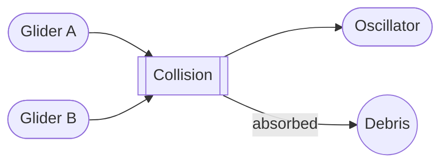
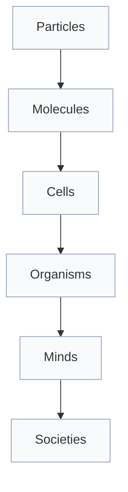
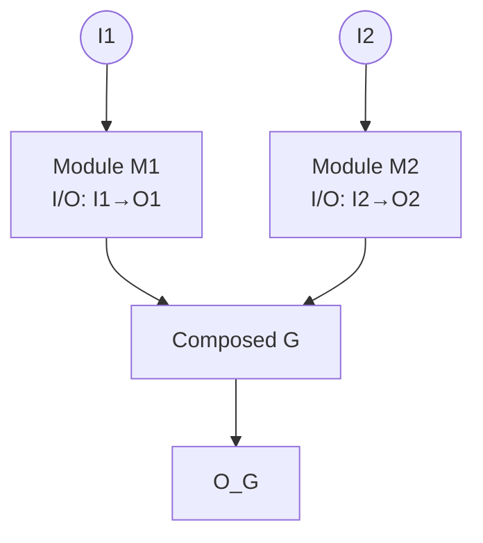

# Figures and Tables — Plan

Figures (conceptual placeholders + sketch notes)
- F1: Dynamic invariants in CA — glider and logic via collisions. Purpose: visualize moving computational primitives. Sketch: 3‑panel strip; panel A shows 2D Life glider across timesteps; panel B shows collision of two gliders turning into a stationary oscillator (logic); panel C labels input/output tracks. File: `fig1_dynamic_invariants.svg`.
- F2: Scale map — particles→molecules→cells→organisms→minds→societies with representation, redundancy, energy flow annotations. Purpose: show hierarchical composition. Sketch: layered Sankey/flow diagram; each layer box has bullets for representation medium, redundancy type, energy source; arrows indicate composition upward and feedback downward. File: `fig2_scale_map.svg`.
- F3: Redundancy vs error — curves of error probability vs redundancy density; knee behavior and diminishing returns. Purpose: illustrate Section 6 trade‑offs. Sketch: log‑error on y‑axis, redundancy density on x‑axis; multiple curves for different noise p; mark optimum (ρ_R*). File: `fig3_redundancy_error.svg`.
- F4: Mutual information decay with refresh knees — I(a_t; a_{t+τ}) over τ with/without refresh. Purpose: operational signature of persistence. Sketch: two curves; with refresh shows saw‑tooth/knees at refresh intervals vs smooth exponential decay without refresh. File: `fig4_mi_refresh.svg`.
- F5: Module contracts and composition — interfaces, budgets, and persistence metrics at two scales. Purpose: demonstrate Section 5 composition. Sketch: block diagram with two modules composing into a higher‑level module; annotate I/O, noise budget, resource budget, and resulting L_p. File: `fig5_module_composition.svg`.

Tables
- T1: Cross‑scale mapping — layer, representation medium, computation type, redundancy mechanism, energy throughput, persistence notes. Sketch: 6 rows for layers; concise 1‑line entries per column.
- T2: Metrics summary — definitions (L_p, E(τ), ρ_R, J_E, Σ) and measurement approach. Sketch: include formula snippets and measurement notes per metric.

Mermaid/Code Drafts
- F1 (logic via collisions, flowchart simplification):


- F2 (scale map, layered flowchart):


- F3 (redundancy vs error, vega-lite JSON sketch):
```vega-lite
{
  "$schema": "https://vega.github.io/schema/vega-lite/v5.json",
  "description": "Error vs redundancy density",
  "data": {"values": [
    {"rho": 0.1, "logerr": -1, "p": 0.01}, {"rho": 0.5, "logerr": -2, "p": 0.01},
    {"rho": 0.1, "logerr": -0.5, "p": 0.05}, {"rho": 0.5, "logerr": -1.2, "p": 0.05}
  ]},
  "mark": "line",
  "encoding": {
    "x": {"field": "rho", "type": "quantitative", "title": "Redundancy density (ρ_R)"},
    "y": {"field": "logerr", "type": "quantitative", "title": "log Error prob"},
    "color": {"field": "p", "type": "nominal", "title": "noise p"}
  }
}
```

- F4 (MI with refresh, vega-lite JSON sketch):
```vega-lite
{
  "$schema": "https://vega.github.io/schema/vega-lite/v5.json",
  "description": "Mutual information vs lag with/without refresh",
  "data": {"values": [
    {"tau": 0, "I": 1, "cond": "refresh"}, {"tau": 5, "I": 0.8, "cond": "refresh"},
    {"tau": 6, "I": 0.95, "cond": "refresh"}, {"tau": 10, "I": 0.75, "cond": "refresh"},
    {"tau": 0, "I": 1, "cond": "no refresh"}, {"tau": 10, "I": 0.6, "cond": "no refresh"},
    {"tau": 20, "I": 0.4, "cond": "no refresh"}
  ]},
  "mark": "line",
  "encoding": {
    "x": {"field": "tau", "type": "quantitative", "title": "Lag (τ)"},
    "y": {"field": "I", "type": "quantitative", "title": "I(a_t; a_{t+τ})"},
    "color": {"field": "cond", "type": "nominal", "title": "condition"}
  }
}
```

- F5 (module composition, flowchart):


- F6 (edge-of-chaos complexity vs λ):
```vega-lite
{
  "$schema": "https://vega.github.io/schema/vega-lite/v5.json",
  "description": "Complexity vs Langton's lambda parameter",
  "data": {"values": [
    {"lambda": 0.05, "complexity": 0.1}, {"lambda": 0.15, "complexity": 0.2},
    {"lambda": 0.25, "complexity": 0.4}, {"lambda": 0.35, "complexity": 0.7},
    {"lambda": 0.45, "complexity": 0.95}, {"lambda": 0.55, "complexity": 0.85},
    {"lambda": 0.65, "complexity": 0.6}, {"lambda": 0.75, "complexity": 0.35},
    {"lambda": 0.85, "complexity": 0.2}, {"lambda": 0.95, "complexity": 0.1}
  ]},
  "mark": "line",
  "encoding": {
    "x": {"field": "lambda", "type": "quantitative", "title": "Langton's λ"},
    "y": {"field": "complexity", "type": "quantitative", "title": "Complexity (arb.)"}
  }
}
```

- F7 (mutual information vs coarse-graining level):
```vega-lite
{
  "$schema": "https://vega.github.io/schema/vega-lite/v5.json",
  "description": "Mutual information across lags for raw vs coarse-grained variables",
  "data": {"values": [
    {"tau": 0, "I": 1.0, "cond": "raw"}, {"tau": 5, "I": 0.7, "cond": "raw"},
    {"tau": 10, "I": 0.45, "cond": "raw"}, {"tau": 15, "I": 0.3, "cond": "raw"},
    {"tau": 0, "I": 1.0, "cond": "coarse"}, {"tau": 5, "I": 0.8, "cond": "coarse"},
    {"tau": 10, "I": 0.6, "cond": "coarse"}, {"tau": 15, "I": 0.45, "cond": "coarse"}
  ]},
  "mark": "line",
  "encoding": {
    "x": {"field": "tau", "type": "quantitative", "title": "Lag (τ)"},
    "y": {"field": "I", "type": "quantitative", "title": "I(a_t; a_{t+τ})"},
    "color": {"field": "cond", "type": "nominal", "title": "Variable"}
  }
}
```

- F8 (correlation length vs noise):
```vega-lite
{
  "$schema": "https://vega.github.io/schema/vega-lite/v5.json",
  "description": "Correlation length as a function of noise",
  "data": {"values": [
    {"noise": 0.0, "xi": 50}, {"noise": 0.05, "xi": 40}, {"noise": 0.1, "xi": 30},
    {"noise": 0.15, "xi": 22}, {"noise": 0.2, "xi": 16}, {"noise": 0.25, "xi": 12},
    {"noise": 0.3, "xi": 9}, {"noise": 0.35, "xi": 7}, {"noise": 0.4, "xi": 5}
  ]},
  "mark": "line",
  "encoding": {
    "x": {"field": "noise", "type": "quantitative", "title": "Noise level"},
    "y": {"field": "xi", "type": "quantitative", "title": "Correlation length (ξ)"}
  }
}
```

- F9 (energy per reliable operation vs target error, Landauer bound):
```vega-lite
{
  "$schema": "https://vega.github.io/schema/vega-lite/v5.json",
  "description": "Energy cost vs target bit error with Landauer bound",
  "layer": [
    {
      "data": {"values": [
        {"err": 1e-1, "E": 5}, {"err": 1e-2, "E": 8}, {"err": 1e-3, "E": 12},
        {"err": 1e-4, "E": 17}, {"err": 1e-5, "E": 23}
      ]},
      "mark": {"type": "line", "color": "#2563eb"},
      "encoding": {
        "x": {"field": "err", "type": "quantitative", "scale": {"type": "log"}, "title": "Target bit error"},
        "y": {"field": "E", "type": "quantitative", "title": "Energy per op (arb.)"}
      }
    },
    {
      "data": {"values": [{"err": 1e-5, "E": 1}, {"err": 1e-1, "E": 1}]},
      "mark": {"type": "rule", "color": "#ef4444"},
      "encoding": {
        "x": {"field": "err", "type": "quantitative", "scale": {"type": "log"}},
        "y": {"field": "E", "type": "quantitative"}
      }
    }
  ]
}
```

- F10 (variety–performance saturation):
```vega-lite
{
  "$schema": "https://vega.github.io/schema/vega-lite/v5.json",
  "description": "Performance vs controller variety (requisite variety)",
  "data": {"values": [
    {"variety": 1, "perf": 0.2}, {"variety": 2, "perf": 0.35}, {"variety": 3, "perf": 0.5},
    {"variety": 4, "perf": 0.65}, {"variety": 5, "perf": 0.75}, {"variety": 6, "perf": 0.82},
    {"variety": 7, "perf": 0.87}, {"variety": 8, "perf": 0.9}
  ]},
  "mark": "line",
  "encoding": {
    "x": {"field": "variety", "type": "quantitative", "title": "Controller variety (arb.)"},
    "y": {"field": "perf", "type": "quantitative", "title": "Performance"}
  }
}
```

 - F11 (origins heatmap: persistence vs fidelity × replication rate):
```vega-lite
{
  "$schema": "https://vega.github.io/schema/vega-lite/v5.json",
  "description": "High‑resolution lineage persistence heatmap (fidelity × replication)",
  "width": 1600,
  "height": 1200,
  "data": {"sequence": {"start": 0, "stop": 30000, "step": 1}},
  "transform": [
    {"calculate": "200", "as": "nF"},
    {"calculate": "150", "as": "nR"},
    {"calculate": "0.90", "as": "fMin"},
    {"calculate": "1.00", "as": "fMax"},
    {"calculate": "0.50", "as": "rMin"},
    {"calculate": "2.00", "as": "rMax"},
    {"calculate": "(datum.fMax - datum.fMin) / datum.nF", "as": "fStep"},
    {"calculate": "(datum.rMax - datum.rMin) / datum.nR", "as": "rStep"},
    {"calculate": "floor(datum.data / datum.nR)", "as": "fi"},
    {"calculate": "datum.data % datum.nR", "as": "ri"},
    {"calculate": "datum.fMin + datum.fi * datum.fStep", "as": "f"},
    {"calculate": "datum.f + datum.fStep", "as": "f2"},
    {"calculate": "datum.rMin + datum.ri * datum.rStep", "as": "r"},
    {"calculate": "datum.r + datum.rStep", "as": "r2"},
    {"calculate": "pow(max(1e-6, datum.f - 0.9), 2.5) * pow(datum.r, 1.2)", "as": "persist"}
  ],
  "mark": "rect",
  "encoding": {
    "x": {"field": "f", "type": "quantitative", "title": "Copy fidelity (f)", "scale": {"domain": [0.90, 1.00]}},
    "x2": {"field": "f2"},
    "y": {"field": "r", "type": "quantitative", "title": "Replication rate (r)", "scale": {"domain": [0.50, 2.00]}},
    "y2": {"field": "r2"},
    "color": {"field": "persist", "type": "quantitative", "title": "Persistence (arb.)", "scale": {"scheme": "viridis", "type": "log", "domain": [1e-6, 1e-2]}}
  },
  "config": {"view": {"stroke": null}}
}
```

- F12 (complexity measures across rules):
```vega-lite
{
  "$schema": "https://vega.github.io/schema/vega-lite/v5.json",
  "description": "Entropy rate vs LZ complexity across rule classes",
  "data": {"values": [
    {"H": 0.2, "LZ": 0.3, "class": "I"}, {"H": 0.4, "LZ": 0.5, "class": "II"},
    {"H": 0.7, "LZ": 0.8, "class": "IV"}, {"H": 0.9, "LZ": 0.6, "class": "III"}
  ]},
  "mark": {"type": "point", "filled": true},
  "encoding": {
    "x": {"field": "H", "type": "quantitative", "title": "Entropy rate"},
    "y": {"field": "LZ", "type": "quantitative", "title": "LZ complexity"},
    "color": {"field": "class", "type": "nominal", "title": "Wolfram class"}
  }
}
```

- F13 (network robustness: giant component vs node removal):
```vega-lite
{
  "$schema": "https://vega.github.io/schema/vega-lite/v5.json",
  "description": "Robustness under node removal for two topologies",
  "data": {"values": [
    {"q": 0.0, "G": 1.0, "topo": "redundant"}, {"q": 0.2, "G": 0.9, "topo": "redundant"},
    {"q": 0.4, "G": 0.78, "topo": "redundant"}, {"q": 0.6, "G": 0.6, "topo": "redundant"},
    {"q": 0.8, "G": 0.35, "topo": "redundant"},
    {"q": 0.0, "G": 1.0, "topo": "non-redundant"}, {"q": 0.2, "G": 0.7, "topo": "non-redundant"},
    {"q": 0.4, "G": 0.45, "topo": "non-redundant"}, {"q": 0.6, "G": 0.2, "topo": "non-redundant"},
    {"q": 0.8, "G": 0.05, "topo": "non-redundant"}
  ]},
  "mark": "line",
  "encoding": {
    "x": {"field": "q", "type": "quantitative", "title": "Fraction removed (q)"},
    "y": {"field": "G", "type": "quantitative", "title": "Giant component size fraction"},
    "color": {"field": "topo", "type": "nominal", "title": "Topology"}
  }
}
```

Notes
- Use simple line drawings or schematics initially; refine after core text stabilizes.
- If we move to LaTeX, convert these into TikZ/PGF or vector graphics.
