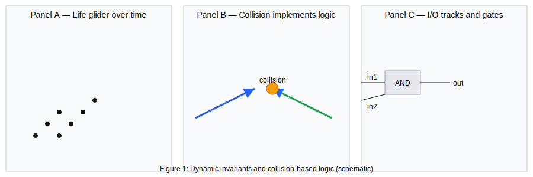
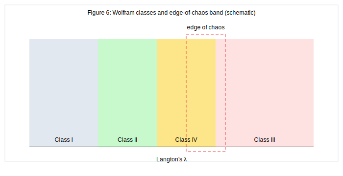
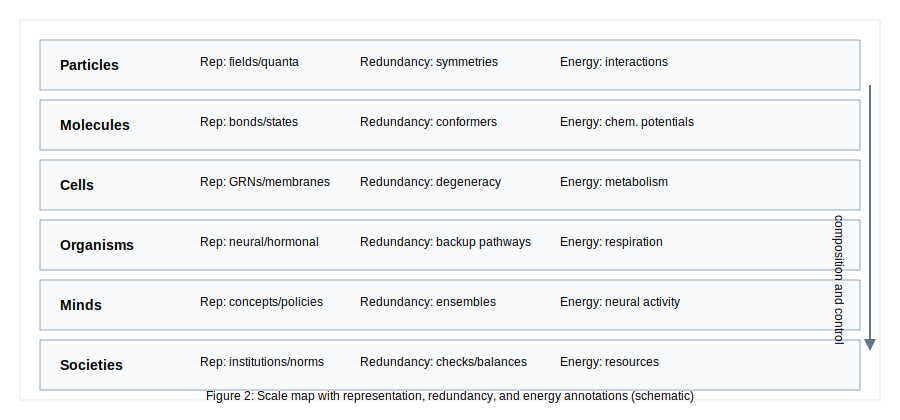
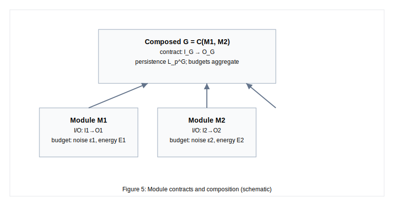
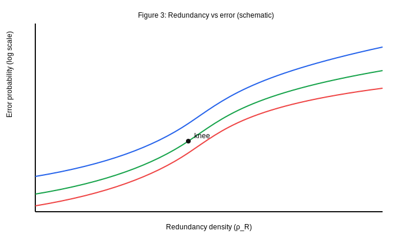
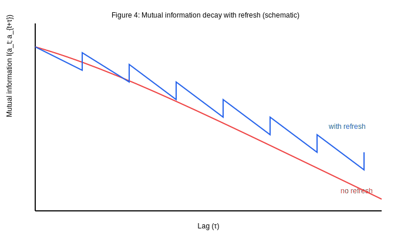

# Unifying Automata Theory, Universal Computation, and Scale‑Invariant Dynamics

Draft status: full draft with author–year citations, figure placeholders, and Pandoc bibliography.

1. Abstract

We advance a unified view of computation, emergence, and persistence across physical and abstract systems. Simple local rules can realize universal computation; in cellular automata, dynamic invariants such as gliders serve as moving primitives that store and process information. Treating computation as physical interaction, we impose non‑triviality via counterfactual causal structure and tie information processing to energy/entropy budgets. We define persistent computation operationally: a system maintains reliable abstract state over time under noise by combining organized dynamics, redundancy, and energy throughput within a coherent I/O boundary.

We propose metrics—persistence length, error profiles, redundancy density, and energy/entropy budgets—and articulate design trade‑offs (e.g., redundancy–energy, edge‑of‑chaos operating points, coarse‑graining benefits). A hierarchical composition framework explains scale‑invariant organization: modules with stable contracts compose into higher‑level computations. We connect thermodynamics, redundancy, and dynamic kinetic stability; relate incompleteness and requisite variety to adaptive re‑computation; and offer falsifiable predictions, including redundancy–persistence scaling, variety–performance saturation, refresh “knees” in mutual‑information decay, and energy costs approaching Landauer bounds in near‑reversible regimes.

Implications span origin‑of‑life scenarios, AI architectures, and institutional stability. The framework provides modeling and validation pathways via cellular automata, agent‑based simulations, and information‑theoretic analysis. By grounding persistence in computation, we aim to reveal cross‑domain regularities that turn a philosophical thesis into empirically testable science.

2. Introduction

Complex systems from physics, biology, cognition, and society exhibit long‑lived structures that persist and adapt despite noise and environmental change. These structures store, propagate, and transform information—behaving like computations implemented by physical interactions. Yet theory remains fragmented: computer science studies abstract machines; physics emphasizes dynamics and thermodynamics; biology focuses on replication and control; the social sciences analyze institutions and norms. We propose a unifying perspective: persistent structures across scales are computational systems that encode and propagate invariance while expending energy to resist entropy.

Our approach synthesizes three strands. First, automata theory and universality show that simple local rules can implement arbitrary computation; dynamic invariants (e.g., gliders) in cellular automata are moving, interacting computational primitives. Second, computation is physical: information processing incurs energetic cost and must be embodied in causal structures with counterfactual support. Third, emergence organizes computation hierarchically: coarse‑grained variables become effective state at higher scales, enabling modular composition and control.

We formalize “persistent computation” by specifying operational criteria: counterfactual causality, information persistence over time, robustness under noise via redundancy, energy–information feasibility, and coherent input–output boundaries. We introduce metrics (persistence length, error profiles, redundancy density, energy/entropy budgets) and show how hierarchical composition supports scale invariance. We then connect entropy, redundancy, and dynamic kinetic stability; relate incompleteness and requisite variety to adaptation; and discuss implications for origin of life, AI, and institutional stability.

Contributions:
- Operational definition and metrics for persistent computation in physical systems.
- Design trade‑offs linking redundancy, energy/entropy budgets, and persistence.
- A hierarchical composition framework for scale‑invariant computational structure.
- Testable signatures and modeling pathways across cellular automata, agent‑based models, and information‑theoretic analyses.

This lens aims not to reduce domains to slogans but to provide a shared set of tools and predictions. If cross‑domain regularities are observed—e.g., redundancy–persistence scaling and energy costs near thermodynamic bounds—then “computation as persistence” becomes a productive organizing principle across the sciences.

3. Foundations and Related Work

3.1 Automata and Universality

Computation admits many equivalent formalisms, including Turing machines, lambda calculus, register machines, and cellular automata. The Church–Turing thesis informally asserts that any effectively computable function is computable by a Turing machine [@turing1936; @church1936]. Universality follows: there exist machines that can simulate any other within a class, given appropriate encoding. In the cellular automata (CA) family, Rule 110 is Turing‑complete [@cook2004] and Conway’s Game of Life supports universal construction [@berlekamp1982; @rendell2013], establishing that simple, local rules can realize arbitrarily complex computation when embedded in the right dynamical substrate.

These results matter for two reasons. First, they decouple computational power from the particulars of a substrate: logical structure can, in principle, be realized in many media. Second, in discrete dynamical systems the “program” is the rule table and initial configuration; long‑lived structures (e.g., gliders, oscillators, and logical gates built from them) show that computation can be embodied as moving, interacting dynamic invariants rather than static circuits. The billiard ball model of computation and reversible CA demonstrate that logical operations can be embedded in conservative, even reversible, physics, linking logical and physical constraints [@fredkin1982; @toffoli1987].

3.2 Computation as Physical Interaction

Landauer’s principle anchors information to thermodynamics: logically irreversible operations (such as bit erasure) dissipate at least kT ln 2 of heat per bit [@landauer1961]. Bennett’s work on reversible computing shows that, in principle, computation can approach thermodynamic reversibility as logical reversibility increases [@bennett1973; @bennett1982]. Deutsch’s Church–Turing–Deutsch principle extends the thesis to physical law: a universal computing device can simulate any physically realizable process, subject to resource bounds [@deutsch1985]. Recent nonequilibrium developments rigorously connect information processing and thermodynamics [@parrondo2015; @sagawa2009]. These perspectives motivate a physical‑computational stance: computation is a pattern of causal organization in physical processes.

Digital physics proposals (e.g., Zuse, Fredkin–Toffoli, Wolfram, Lloyd) hypothesize that the universe itself may be fundamentally computational [@zuse1969; @fredkin1990; @wolfram2002; @lloyd2000]. Regardless of whether that strong claim is true, the weak claim suffices for this paper: any persistent phenomenon that reliably transforms and propagates information under physical law can be analyzed as computation. Our interest is not to reduce physics to computing, but to use computational structure to unify behaviors across scales—wherever physical interactions implement stable, information‑bearing transformations.

3.3 Non‑trivial Physical Computation: Criteria

Critics of pancomputationalism argue that “everything computes” risks triviality [@putnam1988; @chalmers1996]. To avoid this, we adopt operational criteria commonly discussed in the philosophy of computation and cognitive science [@piccinini2007; @piccinini2015]:

1) Representation mapping: A principled, mechanistic mapping must relate abstract computational states to physical states. The mapping should preserve relevant structure (e.g., homomorphism) and be independent of ad hoc interpretation.

2) Causal organization and counterfactual support: The physical system must have the right causal topology such that, under alternative admissible inputs, distinct outputs would occur. Mere one‑off mirroring of an abstract computation without counterfactual structure does not qualify.

3) Robustness and error tolerance: The computation should be realizable within bounded noise, often via redundancy or error correction. This excludes accidental encodings that fail under minimal perturbation.

4) System boundary and inputs/outputs: The computing system must be a causally coherent subsystem with well‑specified inputs, outputs, and dynamics. This avoids global reinterpretations that ascribe computation to arbitrary collections.

These criteria let us speak precisely about when a physical process implements a computation without collapsing into triviality. They also prepare the ground for “persistent computation” as a unifying lens: persistence requires not only dynamics, but organized redundancy and energy throughput to maintain information against entropy.

4. Emergence and Scale Invariance

4.1 Dynamic Invariants at the Edge of Chaos

In many discrete dynamical systems, long‑lived structures emerge that preserve identity while moving and interacting. In the Game of Life, gliders, spaceships, puffers, and breeders propagate reproducible patterns [@berlekamp1982; @rendell2013]; in Rule 110, gliders (localized defects on a periodic background) interact to realize computation [@cook2004]. Such structures are dynamic invariants: patterns that persist through time despite local updates because they continually “repair” themselves via rule‑guided exchanges with their surroundings. Computational mechanics provides tools (e.g., statistical complexity) to quantify such organization [@crutchfield1989; @crutchfield2001].

Wolfram’s empirical classification suggests that Class IV behavior—between frozen order and turbulence—supports the richest repertoire of such invariants [@wolfram2002]. This “edge of chaos” provides a balance between stability (to retain information) and flexibility (to transmit and transform it) [@langton1990]. Computation arises when interactions among invariants implement logic—via collisions, signal routing, and memory encoded in stable motifs. The practical lesson is that persistence and computation co‑locate in regimes with metastability and nontrivial interaction networks (see also Figure 6).

[Figure 1 (placeholder): Dynamic invariants in CA—glider and collision‑based logic; label inputs/outputs.]

4.2 Multi‑Scale Emergence and Computational Phase Transitions

Emergent structures often compose hierarchically: repeated interactions among micro‑invariants give rise to meso‑level modules and macro‑scale organizations. Coarse‑graining can expose effective degrees of freedom with simpler descriptions than the underlying micro‑states [@crutchfield2001; @simon1962]. Renormalization theory formalizes when and how macroscopic laws emerge from microscopic dynamics [@kadanoff1966; @wilson1971]. From a computational standpoint, this is representation change: the system implements new, higher‑level state variables that are more predictive at that scale and can, in some cases, exhibit causal emergence [@hoel2017].

We hypothesize “computational phase transitions” across scales: as control parameters (e.g., coupling, noise, resources) vary, the system crosses thresholds where new computational primitives (memory, communication, control) become available. Candidate empirical signatures include:

- Growth in correlation length and mutual information across scales.
- Stabilization of reusable modules with well‑defined input–output semantics.
- Reduction in description length at the appropriate coarse‑graining (improved predictability).

Conceptually, we can map analogies across domains: CA gliders ↔ particles; reaction–diffusion spots/stripes ↔ cell fates; biochemical circuits ↔ logic networks; organisms ↔ recursive control systems; social institutions ↔ meta‑computational networks. In each case, persistence requires mechanisms that buffer noise (redundancy), constrain dynamics (rules/constraints), and channel energy/entropy flows to maintain structure. These parallels motivate a common framework for persistent computation that we formalize in Section 5.

[Figure 2 (placeholder): Scale map from particles→molecules→cells→organisms→minds→societies with annotations (representation medium, redundancy mechanism, energy throughput).]

5. Persistent Computation: A Unified Framework

5.0 Assumptions and Scope

We formalize systems under explicit assumptions to ensure testable, non‑trivial claims.

- State space and dynamics: A system S is represented on a measurable state space X (finite, countable, or continuous) with update map F: X × U × N × E → X. Markovianity is assumed at the chosen state resolution; non‑Markov dynamics may be augmented by state expansion.
- Inputs and disturbances: U is an admissible input set with a specified distribution/class of input processes; N is a noise/disturbance space with bounded moments or specified distributional constraints.
- Environment: E denotes exogenous variables (e.g., resources, temperature) that are either controlled or have specified statistics.
- Observation and representation: h: X → Y defines observable outputs; m: X → A defines an abstract representation for computation with appropriate measurability and structure preservation.
- Redundancy and control: R denotes redundancy/error‑control mechanisms (codes, replication, feedback) with explicit resource budgets (space/time/energy/latency).
- Operating regime: Either (i) a finite horizon [0, T] with admissible U and bounded disturbances, or (ii) a stationary/ergodic regime where expectations are well‑defined.
- Interfaces and causal coherence: S exposes input/output interfaces that define a causally coherent computing subsystem with counterfactual support under admissible inputs.
- Thermodynamics: Energy throughput P_E and entropy production Σ are accounted for at the implementation level; logically irreversible steps are bounded by Landauer‑type costs.

System tuple. We write

S = (X, F, U, N, E, h, m, R, P_E, Σ)

to collect the elements above. At a fixed scale and representation m, S implements a computation over A via the abstract trajectory a_t = m(x_t). When multiple coarse‑grainings are valid, each m induces a distinct abstract computation on the same physical S.

5.1 Formal Definition

We model a candidate system S as a physically realized dynamical process with inputs, outputs, and an environment:

- State space X with state x_t ∈ X at time t and update rule F (possibly stochastic) so that x_{t+1} = F(x_t, u_t, n_t, e_t), where u_t are inputs, n_t noise/disturbances, and e_t environment variables.
- Observation/encoding map h: X → Y to define measurable outputs y_t = h(x_t).
- Representation map m: X → A into an abstract computational state space A that preserves relevant structure for the task/semantics.
- Energy throughput P_E(t) and entropy production Σ(t), acknowledging Landauer’s bound for logically irreversible operations.
- Redundancy scheme R (e.g., error‑correcting codes, degeneracy, feedback) that yields noise tolerance ε* at scale of interest.

Definition (Persistent computation). The system S implements a persistent computation with respect to representation m and admissible input distribution U if the following conditions hold on a target time horizon T and scale τ (or in the stationary case, uniformly in t):

1) Causal organization and counterfactual support: For admissible variations in inputs U, the induced abstract trajectories a_t = m(x_t) vary in a way consistent with the intended computation; distinct inputs lead to appropriately distinct outputs.
2) Persistence of information: There exists a nontrivial lower bound θ > 0 such that inf_{t ∈ [0, T−τ]} I(a_t; a_{t+τ}) ≥ θ, where I denotes mutual information under the system’s stationary (or controlled) distribution. Equivalently, predictive information remains bounded away from zero [@bialek2001], or description length of a_{t+τ} given a_t does not blow up.
3) Robustness under noise: For admissible noise n_t with bounded magnitude/variance, the computation remains within an error budget δ with probability ≥ 1 − α, as witnessed by R.
4) Energy–information feasibility: The mean energy throughput satisfies the thermodynamic budget for the realized logical irreversibility: Ē_T ≥ kT ln 2 · B_erase, where B_erase is the expected number of erased bits over horizon T (or the process is logically reversible to the extent this cost is mitigated).
5) System boundary and I/O contract: S forms a causally coherent subsystem with specified input and output interfaces; the computation is not an arbitrary reinterpretation of unrelated dynamics.

The pair (m, R) fixes the semantics and reliability regime. Different choices of m (coarse‑grainings) induce different abstract computations on the same substrate S, allowing us to talk about scale‑dependent computation while avoiding trivial re‑labeling.

5.2 Persistence Metrics and Trade‑offs

To make the definition operational we track measurable quantities:

- Persistence time L_p(τ): the largest horizon T for which I(a_t; a_{t+τ}) ≥ θ holds over t ∈ [0, T − τ].
- Error profile E(τ): expected task error at lag τ under admissible U and n_t.
- Redundancy density ρ_R: overhead (spatial, temporal, or energetic) devoted to redundancy and error control.
- Energy flux J_E and entropy production Σ: per‑step or per‑operation energy/entropy budgets relative to logical irreversibility.
- Resilience function R(Δ): maximum disturbance Δ tolerated while keeping E(τ) within budget δ.

Heuristic design laws follow [@landauer1961; @bennett1973; @bennett1982; @shannon1948; @hamming1950; @gallager1962; @gallager1968; @berrou1993; @mackay1999; @polyanskiy2010]:

- Redundancy–energy trade‑off: Increasing ρ_R typically reduces E(τ) at the cost of higher J_E and latency; reversible designs can reduce Σ but often require more structure.
- Edge‑of‑chaos window: Operating points with sufficient metastability maximize L_p for fixed resource budgets by balancing memory and transformability.
- Scale benefit via coarse‑graining: Appropriate m that captures effective degrees of freedom can increase θ and L_p even when micro‑states are noisy.

Table 2 (placeholder): Metrics summary and measurement approach

| Metric | Definition | Measurement approach |
|---|---|---|
| L_p(τ) | Largest horizon T s.t. I(a_t; a_{t+τ}) ≥ θ | Estimate mutual information under stationary/controlled runs |
| E(τ) | Expected task error at lag τ | Task-specific loss under admissible inputs/noise |
| ρ_R | Resource fraction for redundancy | Code rate, replication factor, structural overhead |
| J_E, Σ | Energy flux, entropy production | Instrumentation, implementation-level counters |

5.3 Hierarchical Composition and Scale‑Invariant Structure

We treat persistent computations as composable modules with contracts:

- Each module M_i = (X_i, F_i, m_i, R_i, I_i, O_i) has an input interface I_i, output interface O_i, noise budget, and resource budget.
- Composition G = C(M_1, …, M_k) is valid if interface types match and budgets compose (e.g., worst‑case or probabilistic guarantees propagate).
- At the composed scale, define a coarse‑graining m_G and show persistence by verifying the same criteria on G with induced metrics (L_p^G, E_G, ρ_R^G, J_E^G).

Scale‑invariance appears when families of modules repeat across scales with similar contracts after appropriate rescaling [@simon1962]. This offers a principled route to cross‑domain analogies: particles/gliders, circuits/biochemical networks, organisms/agents, institutions/protocols—all as modules that maintain information via redundancy and energy flow while exposing stable I/O semantics.

  

Table 1: Cross‑scale mapping — representation, computation, redundancy, energy, persistence

| Layer       | Representation medium       | Computation type                 | Redundancy mechanism                 | Energy throughput         | Persistence notes |
|-------------|-----------------------------|----------------------------------|--------------------------------------|---------------------------|-------------------|
| Particles   | Fields/quanta                | Scattering, interactions         | Symmetries, conservation laws        | Interactions, radiation   | Stable excitations, conserved quantities |
| Molecules   | Bonds, conformations        | Reaction networks                | Degenerate conformers, parallel paths| Chemical potentials       | Robust pathways under fluctuations |
| Cells       | GRNs, ion channels, membrane| Regulatory circuits, signaling   | Gene duplication, degeneracy, repair | Metabolism (ATP, gradients)| Homeostasis via feedback and repair |
| Organisms   | Neural/hormonal states      | Control, decision-making         | Backup pathways, redundancy in organs| Respiration, metabolism   | Robust function under perturbations |
| Minds       | Concepts, policies           | Planning, inference              | Ensemble codes, distributed memory   | Neural activity           | Long-horizon goals, adaptivity |
| Societies   | Institutions, norms, protocols| Coordination, governance        | Overlapping roles, checks/balances   | Resource flows            | Resilience to shocks via redundancy |

5.4 Modeling Pathways and Validation

The framework supports multiple modeling approaches:

- Cellular automata and lattice models: Demonstrate dynamic invariants, logic via collisions, and effects of redundancy (e.g., replicated channels, error‑correcting tilings) on L_p and E(τ).
- Agent‑based and network models: Show module composition, interface contracts, and phase transitions where new computational primitives emerge (memory, communication, control).
- Information‑theoretic analysis: Estimate I(a_t; a_{t+τ}), predictive information, transfer entropy between modules [@schreiber2000], and error exponents under perturbations; relate to statistical complexity where appropriate [@crutchfield1989]. Compare energy/entropy budgets to Landauer‑style costs.

Validation plan for case studies:

1) Define m and task semantics explicitly; justify counterfactual support experimentally (alternative input trials) or analytically.
2) Measure persistence metrics and resilience; sweep redundancy and operating points to trace trade‑offs.
3) Demonstrate hierarchical composition by building two‑level modules and showing improved L_p at the higher level despite noisy micro‑dynamics.
4) Report falsifiable signatures (e.g., monotone relation between ρ_R and L_p up to saturation; minimum energy cost per reliable bit‑operation approaching kT ln 2 in the reversible limit).

6. Entropy, Redundancy, and Stability

6.1 Thermodynamics of Information

Information processing has energetic and entropic costs. Landauer’s bound lower‑limits the dissipation of logically irreversible operations [@landauer1961]; Bennett showed that logical reversibility can, in principle, asymptotically approach thermodynamic reversibility [@bennett1973; @bennett1982]. In practice, physical implementations contend with noise and dissipation; modern developments integrate information and nonequilibrium thermodynamics [@parrondo2015; @sagawa2009], so the engineering problem is to maintain reliable information flow under finite resources while respecting those constraints.

Shannon’s theory bounds reliable communication and storage: for a channel with capacity C, codes with rate R < C can achieve arbitrarily small error probability with sufficiently long blocklength [@shannon1948]. In physical systems, capacity depends on noise, bandwidth, and constraints; redundancy trades resources for reliability [@hamming1950; @gallager1962; @gallager1968].

6.2 Redundancy as an Entropy‑Buffering Mechanism

Redundancy appears across scales: error‑correcting codes in digital systems; gene duplication and degeneracy in biology; institutional redundancy in societies. As a sketch, consider a Bernoulli bit‑flip noise p per step. Without protection, the probability that a bit remains correct after t steps decays roughly as (1 − 2p)^{t} in expectation for small p, yielding short persistence times. With a length‑n repetition code and majority vote, the effective error probability after each refresh obeys Chernoff‑type bounds [@chernoff1952]: P_e ≤ exp(−2n(1/2 − p)^2) for p < 1/2, showing exponential suppression in n. Modern codes (turbo, LDPC) and finite‑blocklength analyses sharpen these trade‑offs [@berrou1993; @mackay1999; @polyanskiy2010].

Costs accompany redundancy: spatial/temporal overhead (lower code rate), additional operations (energy/latency), and coordination (control complexity). Persistent computations choose operating points where redundancy density and energy/entropy budgets jointly maximize persistence length L_p for the task.

6.3 Dynamic Kinetic Stability (DKS)

Beyond static stability, many systems persist through turnover. DKS frames persistence as a non‑equilibrium steady state sustained by replication or continual repair. Biological replicators, autocatalytic sets, and even institutional protocols can maintain identity despite component replacement [@england2013; @hordijk2004]. In our framework, DKS is a mechanism to realize persistence conditions: energy throughput supports error correction and self‑maintenance, and the representation map m remains stable under turnover.

6.4 Quantitative Sketches and Predictions

- Reliability exponent vs redundancy: For families of codes, the error probability P_e(n) decays roughly as exp(−n E_r(R, p)) where E_r is a reliability function that depends on rate R and noise p [@gallager1968]. Prediction: holding resources fixed, there exists an optimal redundancy density ρ_R* that maximizes L_p before diminishing returns.
- Energy per reliable bit‑operation: Minimal energy per logically irreversible operation scales with kT ln2; additional overhead grows with required reliability (e.g., to meet δ and α in Section 5). Prediction: as systems approach reversible logic or utilize error‑avoiding subspaces, energy cost per persistent bit can be reduced but at the expense of structure/latency.
- Persistence under refresh: Systems that periodically refresh state via error correction maintain nonzero I(a_t; a_{t+τ}) across long τ, with a knee determined by refresh period and code parameters. Prediction: measurable knees in mutual‑information decay curves indicate refresh cycles.

6.5 Methodological Limitations

Estimating information‑theoretic and persistence metrics in finite data requires care.

- Stationarity and ergodicity: Mutual‑information and predictive‑information estimates assume (piecewise) stationarity or controlled operating regimes. For non‑stationary systems, use windowed/segmented estimation and report drift.
- Discretization and bias: Naïve plug‑in estimators on discretized continuous data are biased; prefer bias‑corrected estimators or continuous‑variable methods (e.g., k‑NN/Kraskov‑type) and report binning sensitivity when discretization is unavoidable.
- Confidence and significance: Provide uncertainty via bootstrap or block‑bootstrap (to respect temporal correlation). For directional measures (e.g., transfer entropy), include shuffle or surrogate tests to assess significance [@schreiber2000].
- Finite‑sample effects: Finite‑blocklength effects matter for coding‑style experiments; where applicable, compare to finite‑blocklength bounds [@polyanskiy2010] rather than asymptotic capacity formulas.
- Coarse‑graining validation: When claiming persistence gains from coarse‑graining, report predictive performance and information retention at multiple scales; avoid overfitting via cross‑validation or out‑of‑sample evaluation. Where appropriate, relate to statistical complexity [@crutchfield1989] or causal emergence analyses [@hoel2017].
- Energy/entropy accounting: When reporting energy per reliable bit‑operation, separate implementation overheads (control, refresh, sensing) from logical irreversibility; report operating temperature and measurement methodology (units in Appendix B).

7. Incompleteness, Control, and Adaptation

7.1 Incompleteness and Unpredictability

Gödel’s incompleteness theorems and Turing’s halting problem show that fixed formal systems are limited: there exist true statements unprovable within the system and programs whose termination is undecidable [@godel1931; @turing1936]. In open environments, any fixed finite rule set will face unforeseen contingencies—practical analogs of undecidable or unmodeled cases. This is not merely metaphor: bounded models lack counterfactual support for all environments, so correctness cannot be guaranteed universally.

7.2 Control Theory and Requisite Variety

Ashby’s Law of Requisite Variety states that a regulator must have (at least) as much variety as the disturbances it must counter [@ashby1956]; the good regulator theorem formalizes this link [@conant1970]. In computational terms, the controller needs a state space and policy class rich enough to represent and act against environmental contingencies. When variety deficit occurs, errors propagate and persistence degrades; redundancy and hierarchical control can supply additional variety at higher levels (e.g., supervisory policies that reconfigure lower‑level controllers).

7.3 Adaptive Open Systems: Continual Re‑Computation

Adaptive systems maintain persistence by updating models and policies in response to prediction errors. Mechanistically, this is a meta‑computation over representations m and redundancy schemes R: revise the mapping and protection mechanisms to restore persistence bounds. Examples include biological immune systems (continual repertoire updates), online error‑control protocols (rateless coding, ARQ/Hybrid‑ARQ), and institutional learning (policy revision cycles). The free‑energy principle offers one formal route to such adaptive inference dynamics [@friston2010].

7.4 Governance Analogy and Failure Modes

Fixed rule regimes risk brittleness: as environments drift, unhandled cases accumulate, leading to failure cascades. Diagnostics in our framework include drops in I(a_t; a_{t+τ}), rising error profiles E(τ), and variety deficits measured by mismatch between disturbance entropy and controller capacity. Remedies include adding redundancy channels, elevating control to supervisory layers, or expanding representation (coarse‑graining that captures new effective variables).

7.5 Testable Signatures

- Variety–performance curve: performance saturates once controller variety matches disturbance variety; beyond that, returns diminish.
- Adaptation rate thresholds: if environmental drift outpaces model update capacity, L_p collapses; restoring balance re‑establishes persistence.
- Multi‑level control benefits: adding a supervisory layer that reconfigures base policies extends L_p under the same disturbance statistics.

8. Discussion and Implications

8.1 Origin of Life and Abiogenesis

In this lens, life begins when chemical networks achieve persistent computation: representations of catalytic states and templates are maintained by redundancy (compartmentalization, autocatalysis) and energy throughput. DKS explains how turnover coexists with identity [@pross2004; @pross2012; @england2013]. Predictions include scaling relations between redundancy density (e.g., copy fidelity times replication rate) and lineage persistence. Classic origins frameworks emphasize replicator fidelity and autocatalytic organization [@eigen1971; @kauffman1986; @hordijk2004].

8.2 AI and Self‑Organizing Computation

Architectures that operate near the edge of chaos, with explicit redundancy and error correction, may offer better long‑horizon reliability. Hierarchical modules with stable I/O contracts support reconfiguration and continual learning (meta‑computation). Energy budgets become first‑class: align algorithmic irreversibility with hardware dissipation to bound costs per reliable operation.

8.3 Societal Stability and Collapse Dynamics

Institutions can be analyzed as persistent computations. Redundancy appears as overlapping functions (checks and balances); failure modes arise from variety deficits or energy/resource constraints. Measurable hypotheses: redundancy density correlates with institutional lifespan up to a saturation point; rapid environmental change requires either increased controller variety or adaptive cycles, else persistence collapses.

8.4 Falsifiability and Cross‑Domain Laws

We propose measurable signatures across domains: persistence curves with refresh knees; redundancy–persistence scaling; variety–performance saturation; energy cost per reliable operation approaching thermodynamic bounds in engineered near‑reversible regimes; and directional information flow quantified via transfer entropy where appropriate [@schreiber2000]. Cross‑domain regularities would support a unified theory; deviations identify limits.

9. Limitations and Open Questions

Measurement remains challenging: inferring representation maps m and appropriate coarse‑grainings is nontrivial and context‑dependent. Causal identification of counterfactual structure requires interventions or strong modeling assumptions. The analog vs. digital status of physical processes complicates application of discrete coding results, though information‑theoretic measures are substrate‑agnostic.

Semantic grounding and interpretation risk trivialization; our criteria mitigate but do not eliminate philosophical disputes. Resource accounting (energy, latency) depends on implementation details; general laws will be approximate. Open questions include: how to algorithmically discover effective coarse‑grainings; how universal are edge‑of‑chaos regimes for computation; what are tight bounds on persistence vs. redundancy for non‑IID, structured environments.

10. Conclusion

We argued that persistence, computation, and scale‑invariant dynamics are facets of a single phenomenon: physical processes that maintain and transform information against entropy via organized dynamics, redundancy, and energy throughput. From gliders in cellular automata to biological and social systems, dynamic invariants serve as computational primitives whose interactions realize higher‑level structure. Our framework defines persistent computation operationally, proposes metrics and trade‑offs, and outlines modeling and validation pathways. The implications span origin‑of‑life scenarios, AI architectures, and institutional design. The next steps are empirical: measure persistence curves, redundancy–reliability trade‑offs, and energy costs across systems, and test for cross‑domain regularities that would substantiate a unified theory.

Appendix A: Symbols and Notation

| Symbol | Meaning |
|---|---|
| X | System state space (measurable; finite/countable/continuous) |
| F | State update map F: X × U × N × E → X |
| U | Admissible input set/process class |
| N | Noise/disturbance space and statistics |
| E | Exogenous environment variables |
| h | Observation/encoding map h: X → Y |
| m | Representation map m: X → A (abstract state) |
| R | Redundancy and error‑control mechanisms (codes/replication/feedback) |
| P_E | Energy throughput (power) |
| Σ | Entropy production rate |
| a_t | Abstract state at time t, a_t = m(x_t) |
| y_t | Observed output at time t, y_t = h(x_t) |
| I(·;·) | Mutual information |
| I_p(T) | Predictive information over horizon T |
| L_p(τ) | Persistence horizon at lag τ |
| E(τ) | Expected task error at lag τ |
| ρ_R | Redundancy density (resource fraction) |
| J_E | Energy flux |
| δ, α | Error budget and tail probability thresholds |
| θ | Lower bound on information persistence |
| τ, T | Time lag and time horizon |
| I/O | Input/output interfaces |

Appendix B: Units and Conventions

- Information units: Unless stated otherwise, logs are base 2 and information is measured in bits. For natural logarithms (nats), convert via 1 bit = ln 2 nats.
- Energy units: Energy per logical operation is in joules. Reference thermal energy kT at 300 K ≈ 4.1×10⁻²¹ J. Landauer bound per erased bit: kT ln 2.
- Time and lag: Time is discrete in steps unless specified; lag τ denotes steps between measurements. For continuous‑time systems, treat τ as multiples of the sampling interval.
- Temperature: Default reference temperature is 300 K unless an experiment specifies otherwise.
- Metrics: L_p(τ) is defined at a given τ; E(τ) is task‑specific error; ρ_R is the resource fraction devoted to redundancy (space/time/energy).
- Notation: I(·;·) is mutual information; I_p(T) is predictive information over horizon T; transfer entropy TE(X→Y) may be used to assess directional information flow.

Deutsch, D. 1985. “Quantum theory, the Church–Turing principle and the universal quantum computer.” Proceedings of the Royal Society A.

Eigen, M. 1971. “Selforganization of matter and the evolution of biological macromolecules.” Die Naturwissenschaften.

Fredkin, E. 1990. “Digital mechanics: An informational process based on reversible universal cellular automata.” Physica D.

 
