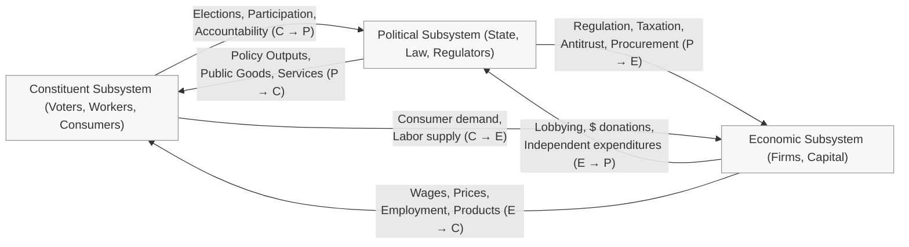
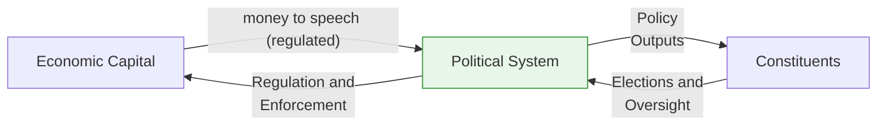
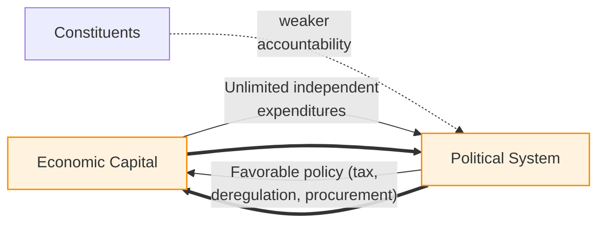
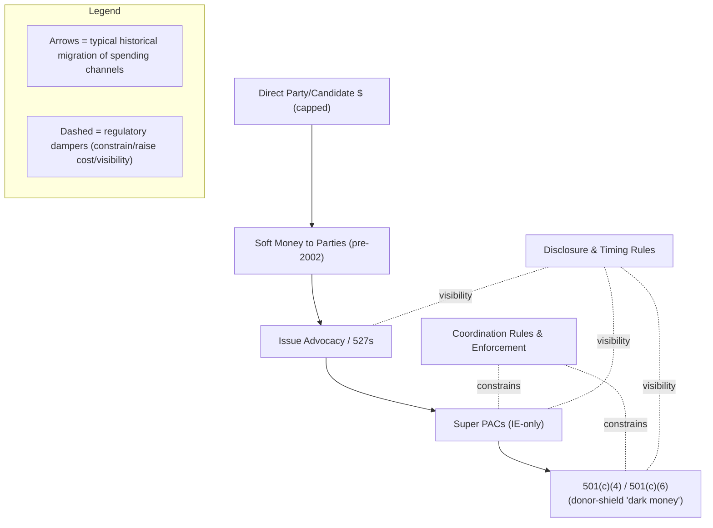
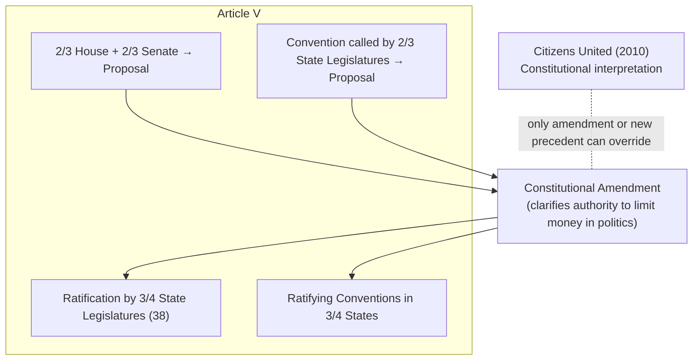
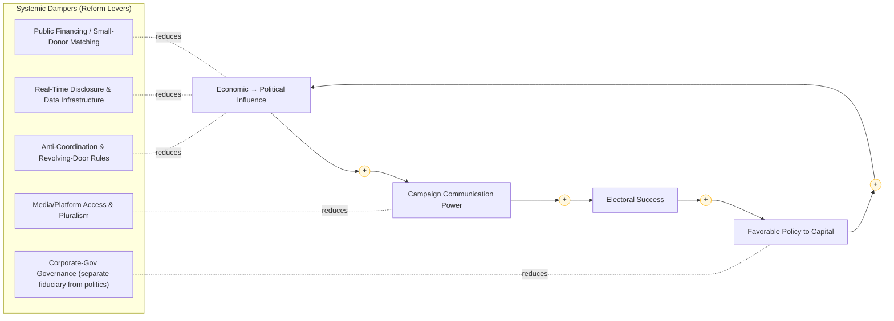
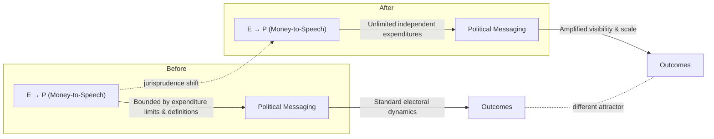

# **Campaign Finance as a Complex System: The Designed Tension Between Market and State in the United States**

## **Abstract**

This paper presents a systems-theoretical analysis of campaign finance in the United States. It traces the historical evolution of political finance regulation and situates it within a broader framework of democratic-capitalist design. Drawing upon systems theory and complexity science, the paper argues that the U.S. political economy was intentionally structured to maintain a dynamic tension between economic and political power—where firms and the state act as countervailing subsystems mediated by the citizenry. The 2010 *Citizens United v. FEC* decision, by reclassifying corporate expenditure as protected speech, disrupted this balance by increasing coupling strength between economic and political domains. The result is a shift from a damped, self-correcting system toward one exhibiting positive feedback and capture dynamics. The paper concludes by outlining the structural and constitutional mechanisms necessary to restore systemic equilibrium.

---

## **1. Introduction**

Money in politics has long been a defining tension of representative democracy. From the earliest attempts to limit patronage and bribery in 19th-century Britain to the intricate network of campaign-finance statutes in the United States, societies have sought to regulate the flow of private capital into public decision-making. In the U.S., this tension has oscillated between two poles: protecting free political expression (including financial expression) and preventing corruption or undue influence.

From a systems-theory standpoint, this is not a flaw but a feature: the constitutional and economic architecture intentionally juxtaposes firm interest (market logic) against political interest (state logic), with constituent interests (citizen logic) mediating. This triadic configuration provides stability through counter-balancing. The problem emerges when structural antagonism is eroded—when one subsystem gains disproportionate influence. U.S. campaign finance offers a clear empirical case of such systemic drift.

---

## **2. Historical Overview of Campaign Finance Regulation in the U.S.**

| **Period**    | **Legal Milestones**                                                                                                                                                                                                                                    | **Systemic Function**                                                                                                |
| ------------- | ------------------------------------------------------------------------------------------------------------------------------------------------------------------------------------------------------------------------------------------------------- | -------------------------------------------------------------------------------------------------------------------- |
| **1907–1947** | *Tillman Act* (1907) banned corporate contributions; *Federal Corrupt Practices Acts* (1910–1925) imposed weak disclosure; *Hatch Act* (1939–40) limited political activity of public employees; *Taft–Hartley* (1947) extended restrictions to unions. | Established boundaries between economic and political capital flows.                                                 |
| **1971–1976** | *Federal Election Campaign Act (FECA)* created disclosure and limits; *1974 Amendments* introduced the FEC and public financing; *Buckley v. Valeo* (1976) upheld contribution limits but struck down expenditure limits.                               | Introduced explicit feedback rules between funding and speech, converting money into a regulated information signal. |
| **2002–2014** | *Bipartisan Campaign Reform Act* (2002) restricted “soft money”; *Citizens United* (2010) permitted unlimited independent expenditures; *SpeechNow* (2010) enabled Super PACs; *McCutcheon* (2014) removed aggregate individual caps.                   | Gradual weakening of damping mechanisms—culminating in open-ended market influence on political communication.       |

Each reform cycle followed a major systemic perturbation—often a scandal (e.g., Watergate) or legal reinterpretation—reflecting a punctuated-equilibrium pattern typical of adaptive regulatory systems.

---

## **3. System Architecture: Politics, Economy, and Constituency**

The system comprises three interdependent subsystems: Economy (E), Politics (P), and Constituents (C). Stability arises from **bounded antagonism** among these domains.

Healthy democracy depends on **gain symmetry** across these feedbacks. When E→P (economic influence on politics) becomes dominant, drift toward *regulatory capture* or *plutocracy* occurs; when P→E dominates, *statism* risks emerge. Robust C→P feedback (elections, oversight) provides damping.

---

## **4. Citizens United and the Loss of Damping**

The 2010 *Citizens United* decision increased the E→P coupling gain by protecting corporate/union independent expenditures as speech and narrowing “corruption” to quid-pro-quo. In systems terms, negative feedback was weakened and positive feedback strengthened.

**Pre-2010 (bounded influence / stronger damping):**

**Post-2010 (strong positive feedback / weaker damping):**

---

## **5. Regulatory Arbitrage and Adaptation Pathways**

As regulators close one channel, the system adapts by shifting to another—soft money → 527s → Super PACs → dark-money nonprofits. This is classic **regulatory substitution** in a complex adaptive network.

---

## **6. Repeal Pathways and Systemic Restoration**

### 6.1 Constitutional Amendment (Article V)

To fully override *Citizens United*, an amendment clarifying authority to limit money in politics is the definitive route.

### 6.2 Judicial Reversal

A future Court could reinterpret corruption or corporate political rights, narrowing or overturning *Citizens United* via new precedent.

### 6.3 Statutory/Institutional Dampers

Short of constitutional change, multi-channel dampers reduce open-ended market influence by lowering loop gain and increasing transparency.

---

## **7. Theoretical Implications: Democracy as a Dissipative Structure**

Democracy functions as a **dissipative structure**—an open system maintaining order via continuous information/resource throughput. Conflict between economic and political power is functional: it prevents entropy by ensuring negotiation. But if monetary energy input exceeds the system’s capacity to dissipate it through regulation and participation, **runaway amplification** occurs—loss of homeostasis.

Where *Citizens United* increased permeability to capital inflows without proportionally strengthening dissipative mechanisms, the system exhibits:

* amplification (funding → visibility → policy → more funding),
* path-dependent attractors around capital interests,
* degraded legitimacy through reduced perceived fairness.

**Where the jurisprudential shift altered the attractor:**

---

## **8. Conclusion**

The American campaign-finance regime illustrates the challenge of maintaining balance in a coupled socio-economic system. Historically, law evolved to manage the interface between market and state, creating dampers that ensured neither domain subsumed the other. *Citizens United* removed a critical constraint, intensifying positive feedback between capital accumulation and political influence. Restoring equilibrium requires layered reform—constitutional clarification, institutional redesign, and re-empowered constituent feedback. In systems terms: **re-introduce negative feedback and re-balance coupling gains** among economic, political, and civic subsystems. The designed tension is the engine of democratic stability; without calibrated boundaries, it overheats—turning productive antagonism into destructive capture.

---

## **Selected Primary Sources**

* *Tillman Act*, Pub. L. 59-36 (1907).
* *Federal Election Campaign Act*, Pub. L. 92-225 (1971); amendments (1974).
* *Buckley v. Valeo*, 424 U.S. 1 (1976).
* *Bipartisan Campaign Reform Act*, Pub. L. 107-155 (2002).
* *Citizens United v. FEC*, 558 U.S. 310 (2010).
* *SpeechNow.org v. FEC*, 599 F.3d 686 (D.C. Cir. 2010).
* *McCutcheon v. FEC*, 572 U.S. 185 (2014).
* Federal Election Commission archives; International IDEA Political Finance database.
