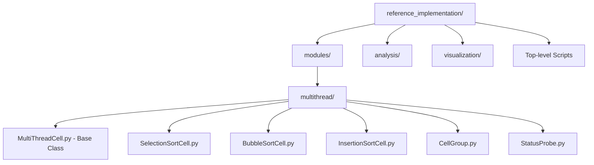
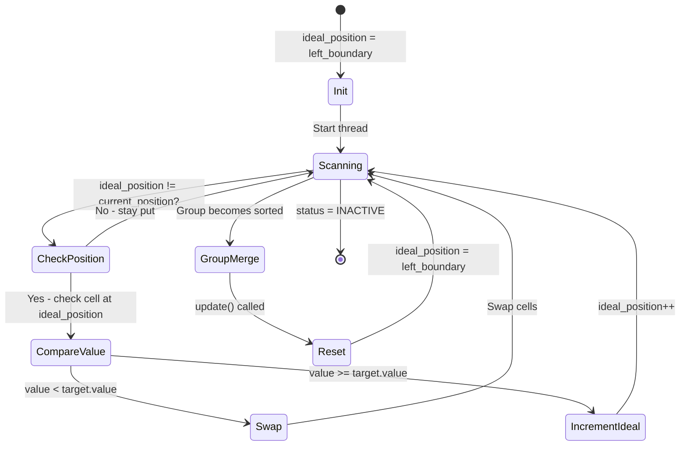
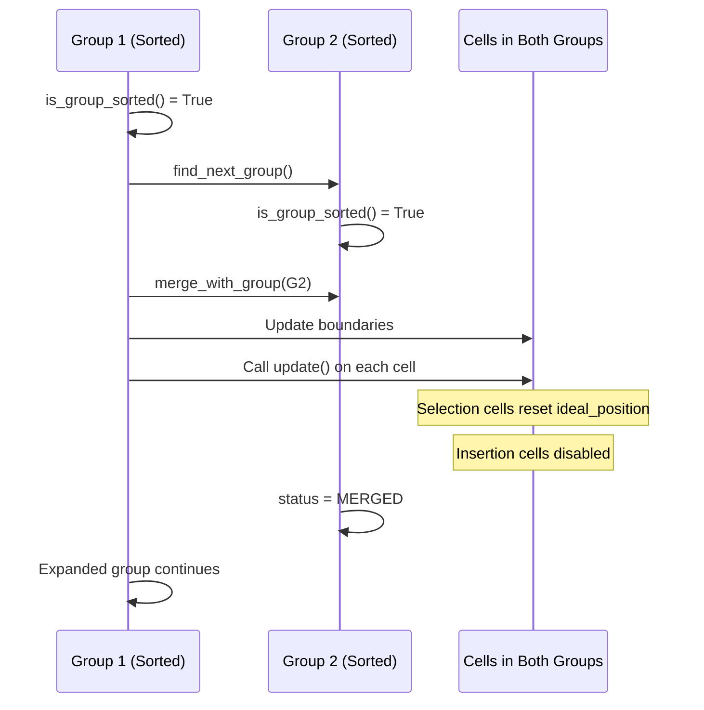
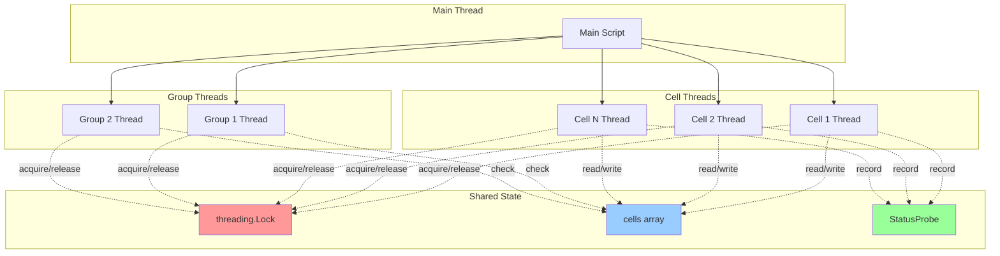

# Reference Implementation

## About

The `reference_implementation/` directory contains the original source code from the paper "Classical Sorting Algorithms as a Model of Morphogenesis" by Zhang, T., Goldstein, A., and Levin, M.

**Repository:** https://github.com/Zhangtaining/cell_research
**Added as:** Git submodule
**Commit:** 1fd2bd5921c1f6b423a71f691d5189106a8a1020

## Purpose

This reference implementation is included to:
- Compare our replication attempts with the original code
- Understand implementation details not fully described in the paper
- Document discrepancies between specification and implementation
- Provide context for questions to the authors

## Repository Structure



## Core Module Architecture

### Base Classes

#### `modules/multithread/MultiThreadCell.py` - Base Thread Class
**Purpose:** Abstract base class for all sorting cell types

**Key Components:**
- **CellStatus Enum:** `ACTIVE`, `SLEEP`, `MERGE`, `MOVING`, `INACTIVE`, `ERROR`, `FREEZE`
- **Inheritance:** Extends `threading.Thread` - each cell runs as independent thread
- **Core Attributes:**
  ```python
  threadID: int                    # Unique identifier
  value: int                       # Cell's numeric value
  current_position: tuple          # (x, y) position in 2D grid
  target_position: tuple           # Where cell is moving to
  ideal_position: tuple | None     # Algorithm-specific target (Selection sort)
  left_boundary: tuple             # Group boundary
  right_boundary: tuple            # Group boundary
  status: CellStatus              # Current cell state
  cells: list                      # Reference to global cell array
  lock: threading.Lock             # Synchronization primitive
  ```

**Key Methods:**
- `swap(target_position)` - Lines 71-98: Atomic cell swap with neighbor
  - Handles frozen cell detection
  - Updates positions for both cells
  - Records statistics via StatusProbe
  - Sets both cells to `MOVING` status during swap
- `run()` - Lines 111-113: Thread main loop - continuously calls `move()` until `INACTIVE`
- `update()` - Line 100-101: Empty hook for algorithm-specific resets (overridden by subclasses)
- `move()` - Abstract method: Implements algorithm-specific movement logic
- `should_move()` - Abstract method: Returns whether cell should attempt movement

**Threading Model:**
- Continuous execution: `while self.status != INACTIVE: self.move()`
- Lock-based synchronization for atomic swaps
- Cells run concurrently, checking and swapping continuously

---

#### `modules/multithread/CellGroup.py` - Group Management Thread
**Purpose:** Manages groups of cells that merge when locally sorted

**Key Components:**
- **GroupStatus Enum:** `ACTIVE`, `MERGING`, `SLEEP`, `MERGED`
- **Inheritance:** Extends `threading.Thread` - group coordinator runs as separate thread

**Core Attributes:**
```python
group_id: int                    # Unique group identifier
cells_in_group: list             # Cells belonging to this group
left_boundary_position: tuple    # Group's left edge
right_boundary_position: tuple   # Group's right edge
status: GroupStatus              # Current group state
phase_period: int                # Time between phase changes
count_down: int                  # Current countdown value
```

**Key Methods:**
- `is_group_sorted()` - Lines 37-44: Checks if all cells in group are in order
- `merge_with_group(next_group)` - Lines 55-73: Merges with adjacent sorted group
  - Updates boundaries for all cells in both groups
  - Calls `cell.update()` on each cell (resets `ideal_position` for Selection sort!)
  - Disables Insertion sort cells during merge
- `change_status()` - Lines 81-91: Alternates between ACTIVE/SLEEP phases
- `run()` - Lines 104-123: Main group thread loop
  - Checks if group is sorted
  - Attempts merge with next group if both sorted
  - Manages phase transitions

**Critical Insight:** The `update()` call in `merge_with_group()` is likely when Selection sort cells reset their `ideal_position`!

---

### Sorting Algorithm Implementations

#### `modules/multithread/SelectionSortCell.py`
**Purpose:** Cell-view selection sort using ideal position tracking

**Algorithm-Specific Attributes:**
```python
ideal_position: tuple  # Initialized to left_boundary (line 14)
cell_type: str = 'Selection'
label: int = 0
reverse_direction: bool
```

**Key Methods:**

**`__init__()` - Lines 9-16:**
- Sets `ideal_position = left_boundary` (or `right_boundary` if reversed)
- This is the starting "search position" for where the cell wants to be

**`should_move()` - Lines 31-32:**
```python
return self.current_position != self.ideal_position and self.within_boundary(self.ideal_position)
```
- Cell wants to move if not at its ideal position

**`should_move_to(target_position)` - Lines 34-65:** ⚠️ **CRITICAL LOGIC**
```python
# Line 59-63: Core comparison logic
if self.value >= self.cells[int(target_position[0])].value:
    self.ideal_position = (self.ideal_position[0] + 1, self.ideal_position[1])
    return False  # Don't swap, increment ideal_position instead
return True  # value < target.value, so swap
```
- **Line 59:** `>=` comparison - if cell's value is greater than OR EQUAL to target
- **Line 61:** Increment `ideal_position` to try next position
- **Line 65:** Return `True` only if `cell.value < target.value`

**Handles Frozen Cells (Lines 35-42):**
- If target cell is frozen, increment `ideal_position` and skip

**`update()` - Lines 77-81:** ⚠️ **RESET MECHANISM**
```python
def update(self):
    self.ideal_position = self.left_boundary  # Reset to start!
```
- Called by CellGroup when merging groups
- Resets search position back to left boundary

**`move()` - Lines 83-98:** Main execution loop
- Acquires lock
- Calls `should_move_to()` to check if swap should happen
- Performs swap if conditions met
- Records statistics

**Critical Behavior:**
- `ideal_position` starts at `left_boundary` (position 0)
- Increments when cell finds values <= itself at ideal position
- Resets to `left_boundary` when groups merge (via `update()`)
- Cells continuously scan from left to right looking for their position

---

#### `modules/multithread/BubbleSortCell.py`
**Purpose:** Local comparison bubble sort

**Algorithm-Specific Attributes:**
```python
cell_vision: int = 1  # Can only see immediate neighbors
cell_type: str = 'Bubble'
```

**Key Methods:**

**`should_move()` - Lines 24-42:**
- Checks if cell is out of order with immediate left OR right neighbor
- Returns `True` if:
  - Smaller than left neighbor (should move left), OR
  - Bigger than right neighbor (should move right)

**`should_move_to(target_position, check_right)` - Lines 44-56:**
```python
# Line 56: Comparison logic
return self.value > target.value if check_right else self.value < target.value
```
- If checking right: swap if `value > target` (bubble up)
- If checking left: swap if `value < target` (bubble down)

**`move()` - Lines 58-74:**
- **Line 66:** Randomly chooses to check left or right (`random.random() < 0.5`)
- Calculates target position as `current ± cell_vision` (±1)
- Swaps if comparison succeeds

**Critical Behavior:**
- Random bidirectional checking (not just one direction)
- Only compares with immediate neighbors (vision = 1)
- No state tracking between moves (stateless comparison)

---

#### `modules/multithread/InsertionSortCell.py`
**Purpose:** Insertion sort with sorted region verification

**Algorithm-Specific Attributes:**
```python
cell_vision: int = 1
cell_type: str = 'Insertion'
```

**Key Methods:**

**`is_enable_to_move()` - Lines 68-83:** ⚠️ **UNIQUE CONSTRAINT**
```python
# Checks if all cells to the LEFT are in sorted order
for i in range(left_boundary, current_position):
    if cells[i].value < prev:  # Out of order
        return False
return True
```
- Cell can only move if region to its LEFT is sorted
- This enforces insertion sort's invariant: sorted region grows from left

**`should_move()` - Lines 24-38:**
- Returns `True` if:
  - Cell is enabled to move (left region sorted), AND
  - Cell is smaller than left neighbor

**`should_move_to(target_position)` - Lines 40-66:**
```python
# Line 61: Simple comparison
return self.value < self.cells[int(target_position[0])].value
```
- Swap if cell value is less than target value

**`move()` - Lines 85-101:**
- **Lines 86-89:** Acquires lock, immediately checks `is_enable_to_move()`, releases lock if disabled
- **Line 96:** Target is always left neighbor: `current_position - 1`
- Only moves leftward into sorted region

**Critical Behavior:**
- Enforces sorted-region invariant via `is_enable_to_move()`
- Only moves left (unlike bubble sort's bidirectional movement)
- Disabled during group merges (line 69 in CellGroup.py)

---

### `modules/multithread/StatusProbe.py` - Metrics Collection
**Purpose:** Tracks sorting statistics and performance metrics

**Tracked Metrics:**
```python
sorting_steps: list          # Array snapshots after each swap
swap_count: int              # Total swaps performed
cell_types: list             # Cell type metadata per step
frozen_swap_attempts: int    # Attempts to swap with frozen cells
compare_and_swap_count: int  # Total comparison operations
```

**Methods:**
- `record_swap()` - Increments swap counter
- `record_compare_and_swap()` - Increments comparison counter
- `record_sorting_step(snapshot)` - Saves array state
- `record_cell_type(snapshot)` - Saves cell type information
- `count_frozen_cell_attempt()` - Tracks frozen cell interactions

---

## Execution Scripts

### Main Entry Points

#### `multithread_cell_group_sorting.py` - Group-Based Sorting with Visualization
**Purpose:** Runs sorting with cell groups that merge when locally sorted

**Key Features:**
- **Mixed Cell Types:** Lines 32-35 - Randomly assigns Bubble or Selection sort to each cell (50/50 probability)
- **Group Creation:** Each cell starts as its own group with random phase period (100-200)
- **Merging:** Groups merge when both are locally sorted
- **Visualization:** Uses Tkinter canvas to display cells and groups

**Setup:**
```python
VALUE_LIST = [28, 34, 6, 20, 7, 89, 34, 18, 29, 51]  # Test array
```

**Execution Flow:**
1. Create cell for each value (random Bubble or Selection type)
2. Create individual CellGroup for each cell
3. Set random phase period and countdown for each group
4. Start all cell threads and group threads
5. Continuous visualization update loop

**Critical Line 38:** Each group starts with random countdown between 0 and its period - creates asynchrony

---

#### `sorting_cells_multithread.py` - Basic Multithreaded Sorting
**Purpose:** Simplest multithreaded execution without groups or visualization

**Key Features:**
- Uses base `MultiThreadCell` class (deprecated for actual sorting)
- Linked-list style cell connections (left_neighbor, right_neighbor)
- Continuous monitoring loop printing current state

**Setup:**
```python
VALUE_LIST = range(50, 0, -1)  # Reverse sorted array
```

---

### Analysis Scripts

Located in `analysis/` directory:

**Performance Analysis:**
- `efficiency_analysis.py` - Measures sorting efficiency metrics
- `performance_analysis.py` - Analyzes algorithm performance
- `valid_move_analysis.py` - Tracks valid vs invalid move attempts

**Cell Behavior Analysis:**
- `cell_type_aggregation_analysis.py` - Studies how cell types cluster and aggregate
- `cell_type_distribution_change.py` - Tracks cell type distribution over time
- `cell_type_distribution_in_group.py` - Distribution within groups
- `delay_gratification_analysis.py` - Analyzes "delayed gratification" behavior
- `delay_gratification_analysis_for_not_move.py` - Delay gratification when not moving
- `delay_gratification_analysis_spearsman.py` - Spearman correlation analysis

**Frozen Cell Analysis:**
- `frozen_cell_moving_attempt.py` - Tracks attempts to move frozen cells
- `frozen_spearmans_distance_results.py` - Distance metrics with frozen cells
- `frozen_success_compare.py` - Compares success rates with/without frozen cells

**Utility:**
- `utils.py` - Shared utility functions
- `points_cloud_size_change.py` - Tracks point cloud evolution

---

### Visualization Scripts

Located in `visualization/` directory:

**Components:**
- `CellImage.py` - Tkinter canvas representation of individual cells
- `CellGroupImage.py` - Tkinter canvas representation of cell groups

**Usage in Scripts:**
- `sorting_2d_cell_visual.py` - 2D cell visualization
- `sorting_with_annimation_visualization.py` - Animated single sorting
- `sorting_with_annimation_visualization_multi.py` - Animated multi-group sorting

---

## Key Algorithm Flow Diagrams

### Selection Sort Cell Lifecycle



### Group Merging Process



### Threading Model Overview



---

## How to Navigate the Reference Implementation

### If you want to understand...

**...how Selection Sort works:**
1. Read `modules/multithread/SelectionSortCell.py` - focus on:
   - `should_move_to()` lines 34-65 (swap logic)
   - `update()` lines 77-81 (reset mechanism)
2. Key insight: `ideal_position` increments on `>=` comparison, resets on group merge

**...how groups merge:**
1. Read `modules/multithread/CellGroup.py` - focus on:
   - `is_group_sorted()` lines 37-44
   - `merge_with_group()` lines 55-73
2. Key insight: `cell.update()` is called on merge, resetting Selection sort state

**...how threading works:**
1. Read `modules/multithread/MultiThreadCell.py` - focus on:
   - `run()` line 111-113 (continuous loop)
   - `swap()` lines 71-98 (lock acquisition)
2. Then read `multithread_cell_group_sorting.py` lines 66-71 (thread startup)

**...the complete execution flow:**
1. Start with `multithread_cell_group_sorting.py`
2. Follow `create_cell_groups_based_on_value_list()` lines 19-50
3. See how threads start in `activate()` lines 66-71
4. Understand main loop lines 113-121

**...what makes this different from our replication:**
1. **Threading:** Reference uses real threads (concurrent), we use sequential timesteps
2. **Positions:** Reference uses 2D tuples `(x, y)`, we use 1D integers
3. **Groups:** Reference has dynamic group merging, we don't (yet)
4. **Reset mechanism:** Reference calls `update()` on merge, we need explicit reset logic
5. **Continuous execution:** Reference cells always run, we process each cell once per timestep

---

## Important Notes

### Architecture Differences

**Original (Reference):**
- Multithreaded: each cell is a separate thread
- Continuous execution
- 2D grid-based positions (tuples)
- Cells continuously attempt moves

**Our Replication:**
- Sequential with randomized order per timestep
- Discrete timesteps
- 1D array positions (integers)
- Cells attempt moves once per timestep

### Critical Insights for Replication

#### Selection Sort Resolution ✓

**The Missing Piece:** Group merging triggers `update()` which resets `ideal_position`

Our investigation found that Selection Sort appeared to get "stuck" because `ideal_position` would increment indefinitely without resetting. The reference implementation solves this through:

1. **Groups start sorted:** Each cell begins as its own group (trivially sorted)
2. **Groups merge:** When adjacent groups are both sorted, they merge (CellGroup.py:55-73)
3. **Reset on merge:** `merge_with_group()` calls `cell.update()` on every cell (line 67)
4. **Selection cells reset:** `SelectionSortCell.update()` sets `ideal_position = left_boundary` (line 80)

**For our timestep-based replication:**
- Without group merging, we need a different reset trigger
- Options:
  - Reset when no swaps occur in a pass
  - Reset when `ideal_position` reaches right boundary
  - Detect local sorted regions and reset cells within them
  - Implement simplified group merging in our timestep model

#### Key Behavioral Differences

**Threading Impact:**
- Reference: Cells execute continuously and asynchronously
- Our replication: Cells execute sequentially in random order per timestep
- **Implication:** Reference has emergent race conditions and timing effects we can't replicate exactly

**Group Phases:**
- Reference: Groups alternate ACTIVE/SLEEP with random periods (100-200 timesteps)
- Purpose: Allows local sorting before attempting merges
- **For replication:** May not need this with timestep model - test both ways

**Position Representation:**
- Reference: 2D tuples `(x, y)` even for 1D arrays (y always 1)
- Our replication: 1D integers
- **Implication:** Need to adapt boundary checks and comparisons

#### Recommended Replication Strategy

**Phase 1: Basic Sorting (Done ✓)**
- ✓ Bubble sort - working correctly
- ✓ Insertion sort - working correctly
- ⚠️ Selection sort - needs reset mechanism

**Phase 2: Fix Selection Sort (Next)**
1. Implement local-sorting detection
2. Trigger `update()` (reset ideal_position) when local region sorted
3. Test with simplified "merge" concept: when cells 0-3 sorted, expand boundary to 0-4

**Phase 3: Group Merging (Optional)**
1. Implement simplified group tracking
2. Detect when groups are sorted
3. Merge adjacent sorted groups
4. Test mixed cell types within groups

See `SELECTION_SORT_INVESTIGATION.md` for detailed analysis of our investigation process.

## Git Submodule Usage

### Initial Clone
If someone else clones the parent repository, they need to initialize submodules:
```bash
git submodule update --init --recursive
```

### Updating Reference Implementation
To pull latest changes from the original repository:
```bash
cd reference_implementation
git pull origin main
cd ..
git add reference_implementation
git commit -m "Update reference implementation to latest"
```

### Removing Submodule (if needed)
```bash
git submodule deinit -f reference_implementation
git rm -f reference_implementation
rm -rf .git/modules/reference_implementation
```

## Citation

If using this reference implementation, cite the original paper:

```bibtex
@article{zhang2024classical,
  title={Classical Sorting Algorithms as a Model of Morphogenesis: self-sorting arrays reveal unexpected competencies in a minimal model of basal intelligence},
  author={Zhang, Taining and Goldstein, Adam and Levin, Michael},
  journal={arXiv preprint arXiv:2401.05375},
  year={2024}
}
```

## Quick Reference Table

| What You Need | File Path | Key Lines/Methods |
|---------------|-----------|-------------------|
| **Selection Sort Logic** | `modules/multithread/SelectionSortCell.py` | `should_move_to()` 34-65, `update()` 77-81 |
| **Bubble Sort Logic** | `modules/multithread/BubbleSortCell.py` | `move()` 58-74 (random direction) |
| **Insertion Sort Logic** | `modules/multithread/InsertionSortCell.py` | `is_enable_to_move()` 68-83 |
| **Selection Sort Reset Mechanism** | `modules/multithread/CellGroup.py` | `merge_with_group()` 55-73, line 67 |
| **Swap Implementation** | `modules/multithread/MultiThreadCell.py` | `swap()` 71-98 |
| **Thread Main Loop** | `modules/multithread/MultiThreadCell.py` | `run()` 111-113 |
| **Comparison Logic (Selection)** | `modules/multithread/SelectionSortCell.py` | Line 59: `if value >= target.value` |
| **Comparison Logic (Bubble)** | `modules/multithread/BubbleSortCell.py` | Line 56: `value > target if check_right else value < target` |
| **Comparison Logic (Insertion)** | `modules/multithread/InsertionSortCell.py` | Line 61: `value < target.value` |
| **Group Merging** | `modules/multithread/CellGroup.py` | `merge_with_group()` 55-73 |
| **Group Sorted Check** | `modules/multithread/CellGroup.py` | `is_group_sorted()` 37-44 |
| **Main Execution Example** | `multithread_cell_group_sorting.py` | Full file, especially 19-50, 66-71 |
| **Cell Status Enum** | `modules/multithread/MultiThreadCell.py` | Lines 7-14 |
| **Group Status Enum** | `modules/multithread/CellGroup.py` | Lines 6-10 |
| **Metrics Collection** | `modules/multithread/StatusProbe.py` | Full file (simple class) |

---

## License

The reference implementation retains its original license from the source repository. Check `reference_implementation/LICENSE` for details.

Our replication code in the parent directory may have a different license - see the main repository LICENSE file.

---

## Document Maintenance

**Last Updated:** December 8, 2024
**Coverage:** Complete mapping of core sorting algorithms, group management, threading model, and execution flow

**Not Yet Documented:**
- Individual analysis scripts (content too specific to experiments)
- `multi_dimentions/` directory (appears unused in main experiments)
- Legacy/deprecated scripts

**Update Strategy:** This README was built incrementally to avoid context overflow. To update:
1. Read the specific file you're documenting
2. Add incremental section to README
3. Reference previous sections to maintain coherence
4. Use mermaid diagrams for complex relationships
